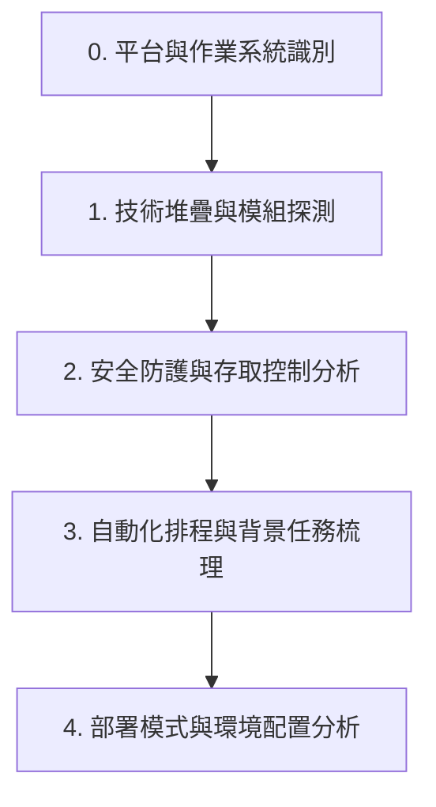

# 系統文檔分析與生成技能手冊 (System Documenter Skill)

本技能文檔為工作區內各式軟體系統專案（如 RHEL/Linux 或 Windows 平台，涵蓋容器化、傳統 Web 應用或純背景服務等不同架構）所制定的通用系統化文檔分析與產出指南。當使用者要求對新專案進行系統分析、排程梳理或撰寫運維/故障排除手冊時，AI 代理人必須加載並嚴格遵循此技能所定義的流程與規範。

---

## 🎯 一、 技能觸發與適用場景

當使用者提出以下需求時，應啟用本技能：

1. 針對新專案進行代碼、架構或業務排程之整體分析（包括跨平台作業系統環境與技術堆疊）。
2. 為系統增補、修正或建立全套的系統文檔與維運手冊。
3. 梳理 Linux Crontab / Windows 工作排程器定時任務與應用程式內部背景排程（如 Quartz、定時執行緒）。

---

## 🔍 二、 專案分析與探測流程 (Methodology)

在撰寫文檔前，AI 代理人必須依序對專案原始碼進行以下維度的靜態探測，以識別其「平台屬性」與「技術架構」，不得憑空臆測：



### 0. 平台與作業系統識別 (Platform Identification)

- **探測目標**：識別專案部署之目標伺服器作業系統環境。
  - **Linux 生態系**：檢查是否有 `.sh` 腳本、Nginx 設定、Systemd 設定檔、RHEL/CentOS 特有配置，或 Linux crontab 設定。
  - **Windows 生態系**：檢查是否有 `.bat`、`.ps1` (PowerShell)、IIS 組態設定（如 `web.config`）、Windows 服務安裝腳本，或 Windows Registry (登錄檔) 讀寫代碼。
  - **影響**：AI 必須根據識別出的平台，在後續文檔中使用該平台專屬的命令與維運概念（如：Linux 的 `tar`/`rsync`/`systemctl` vs Windows 的 `Robocopy`/`Powershell`/`Windows 服務管理`）。

### 1. 技術堆疊與模組架獲探測

- **網頁伺服器 (Web Server / Proxy) 識別**：
  - **Nginx**：檢查是否有 `nginx.conf`、虛擬主機設定（`conf.d/*.conf`）、反向代理配置（`proxy_pass`）或 SSL 憑證路徑。
  - **IIS**：檢查是否有 `web.config`、URL 重寫規則（URL Rewrite）或應用程式集區（App Pool）設定。
  - **Tomcat / Apache**：確認 Java Servlet 容器配置（如 `server.xml`）。
- **程式語言與 Web 框架識別**：
  - **Java**：尋找 `build.gradle` / `pom.xml`，確認框架（如 Grails, Spring Boot, Spring MVC）。
  - **C# (.NET)**：尋找 `.csproj` / `.sln`，確認是 .NET Core (Kestrel) 還是傳統 .NET Framework (IIS ASP.NET)。
  - **Python**：尋找 `requirements.txt` / `pyproject.toml`，確認框架（如 Django, Flask, FastAPI）與 WSGI/ASGI 伺服器（如 Gunicorn, Uvicorn）。
  - **Node.js**：尋找 `package.json`，確認框架（如 Express, Nest.js, Koa）與背景行程管理（如 PM2, BullMQ）。
- **識別架構類型**：
  - **傳統 Web 應用**：主動探測網頁伺服器與後端程式之對應（如 Nginx + Tomcat/Gunicorn/PM2，或是 IIS + ASP.NET）。
  - **容器化服務**：如 Docker/Podman、Kubernetes 設定檔，尋找 `Dockerfile`。
  - **純背景/主機服務**：無 UI 之背景執行緒程式、Daemon 或常駐 Windows 服務。
- **辨識模組職責**：確認是否為多專案分工（如前台端與後台端分離），或是單一整合式專案。

### 2. 安全防護與存取控制分析

- **攔截與過濾機制**：檢查系統如何處理請求過濾。
  - **Java**：尋找 `Interceptor`、`Filter` 或 Spring Security。
  - **C# (.NET)**：檢查 `web.config` 授權規則、MVC 的 `[Authorize]` Attribute，或自訂的 `Middleware`。
  - **Node.js**：尋找自訂 `Middleware`（中間件）、`Guard`（守衛）或 Passport.js 驗證。
  - **Python**：尋找 FastAPI `Depends`、Django `Middleware` 或 Flask 裝飾器。
- **特定安全性原則**：分析是否有強制使用者重設密碼（`resetAcc`）、IP 白名單存取控制、API 免密碼排除路由等核心防禦邏輯。

### 3. 自動化排程與背景任務梳理

- **應用程式內部排程**：分析專案內部的定時任務機制（如 Quartz 插件、.NET 內部 Timer、或 Java Scheduled 註解），梳理其執行時間（Cron Expression）與成功失敗記錄日誌（如寫入 `JobsHistory` 的歷程機制）。
- **作業系統排程**：
  - **Linux**：分析 Linux `crontab` 工作，包含資料備份（MySQL Dump 等）與定期 Log 清理。
  - **Windows**：分析 **Windows 工作排程器 (Task Scheduler)** 匯出之設定檔，梳理其排程觸發器與執行腳本。

### 4. 部署模式與環境配置分析

- **組態設定檔格式探測**：
  - **Java**：`application.yml`、`application.properties`。
  - **C#**：`appsettings.json`、`web.config`。
  - **Node.js / Python**：`.env`、`config.json`、`settings.py`。
  - **分析目標**：資料庫連線、SMTP 發信伺幕器、FTP 設定與系統 Error 信箱等參數。
- **容器與環境隔離**：若有 Docker/Podman，分析 Volume 實體掛載路徑、環境變數及 rootless linger（常駐執行）設定。

---

## 📂 三、 文檔目錄與結構規範

產出文件必須依據業務性質，嚴格劃分為以下四大專題目錄與 11 份標準 Markdown 檔案。結構不得任意縮減：

```
docs/
├── index.md                      # 全域導覽索引 (必須建立)
├── architecture/                 # 【系統架構與設計】
│   ├── index.md                  # 架構專題索引
│   ├── overview.md               # 技術堆疊與整體 MVC 模組架構
│   └── security_auth.md          # 帳號角色 (RBAC) 與安全攔截器設計
├── cronjob/                      # 【自動化排程分析】
│   ├── index.md                  # 排程專題索引
│   ├── [核心JobA]_analysis.md    # 核心排程 A 業務邏輯與回報流程分析
│   └── [核心JobB]_analysis.md    # 核心排程 B 業務/維運備份清理排程分析
├── developer/                    # 【開發與擴充指南】
│   └── extension_guide.md        # 本地啟動與新增/發佈排程/API 指南
└── operations/                   # 【部署與系統運維】
    ├── deployment_guide.md       # 專案編譯、IIS/Tomcat/Docker/Podman 部署與環境配置
    ├── disaster_recovery.md      # 主機災難復原重建、系統/資料庫備份與還原程序手冊
    └── operation_handbook.md     # 承辦人日常維護、參數設定與故障排除 SOP
```

---

## ✍️ 四、 寫作美感與技術名詞規範 (Critical Style Rules)

為維持系統文件的一致性與最高品質，AI 代理人必須嚴格遵守以下寫作約束：

1. **語系與台灣科技術語一致性**：
   - 必須採用 **台灣正體中文 (zh-TW)**。
   - 優先且強制使用台灣慣用科技術語：
     - 預設使用 **「資料庫」**（而非數據庫）
     - 預設使用 **「專案」**（而非項目）
     - 預設使用 **「變數」**（而非變量）
     - 預設使用 **「程式碼」**（而非代碼）
     - 預設使用 **「埠口」**（而非端口）
     - 預設使用 **「映像檔」**（而非鏡像）
2. **架構師視角與潛在風險提示**：
   - 寫作時應展現資深軟體架構師思維。在各排程或安全分析文件尾聲，必須加入 **「架構師業務邏輯觀點與建議」**，誠實指出系統潛在風險（如：API 缺乏認證、郵件報警設定為單一收件人而非群組、網路抖動缺乏 Retry 重試機制等）。
3. **Mermaid 架構圖安全語法**：
   - 當在 Markdown 中繪製 `mermaid` 流程圖或架構圖時，節點標籤若包含括號、括弧等特殊字元，**必須使用雙引號將標籤文字包裹起來**（例如 `id["Label (Extra Info)"]`），防止編譯錯誤。
4. **超連結格式約束**：
   - **非本專案的外部連結**：若需引用外部專案路徑（如 `/AUDIT/` 專案），統一改為以 `/AUDIT/` 開頭的偽路徑。
   - **專案內部連結**：檔案互相引用必須改為 **相對路徑**（如 `./overview.md`），且路徑中斜線一律使用 forward slashes（`/`）。
   - **程式與檔案連結樣式**：
     - 格式必須為 `[連結文字](file:///path/to/file)`。
     - **絕對不准**在連結文字外圍包覆 backticks。
     - _正確範例_：[ClientController.groovy](file:///AUDIT/50_DEV/grails-app/controllers/billing/com/brix/client/ClientController.groovy)
     - _錯誤範例_：[`ClientController.groovy`](file:///AUDIT/50_DEV/grails-app/controllers/billing/com/brix/client/ClientController.groovy)
5. **環境隔離與離線部署考量**：
   - 若專案部署於不能聯網的實體隔離生產環境（Air-Gapped）：
     - 對於 **Linux 容器環境**：必須在部署與運維指南中明文撰寫「**離線環境部署步驟**」，詳細記錄使用 `podman save` / `docker save` 打包映像檔與 `podman load` / `docker load` 還原映像檔的 SOP。
     - 對於 **傳統/Windows 伺服器環境**：必須在部署與運維指南中明文撰寫離線安裝步驟，包含必要 Runtime 安裝檔、離線依賴套件包（如 NuGet/npm 離線還原）、IIS 組態或 Windows Service 離線註冊與備份還原指令（如使用 `sc create` 離線註冊服務）。
