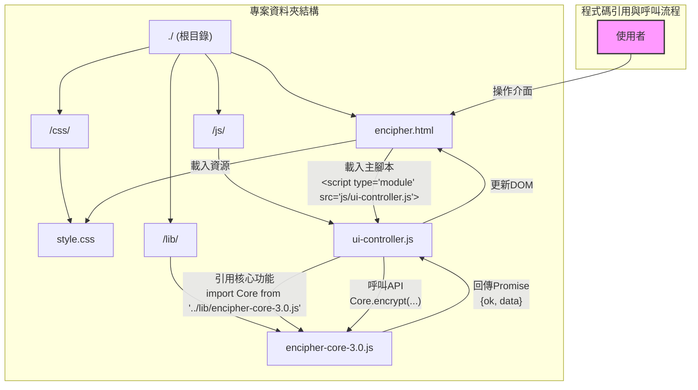
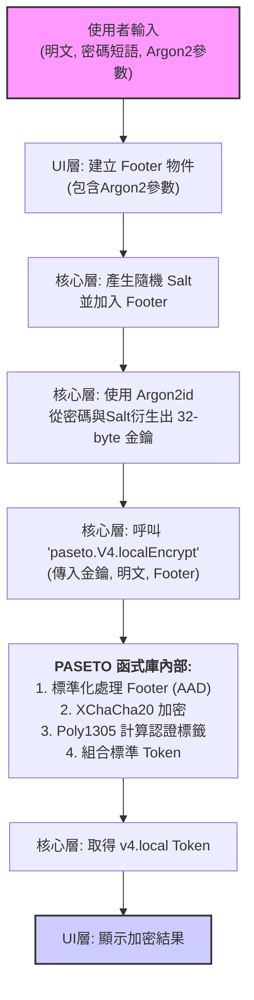
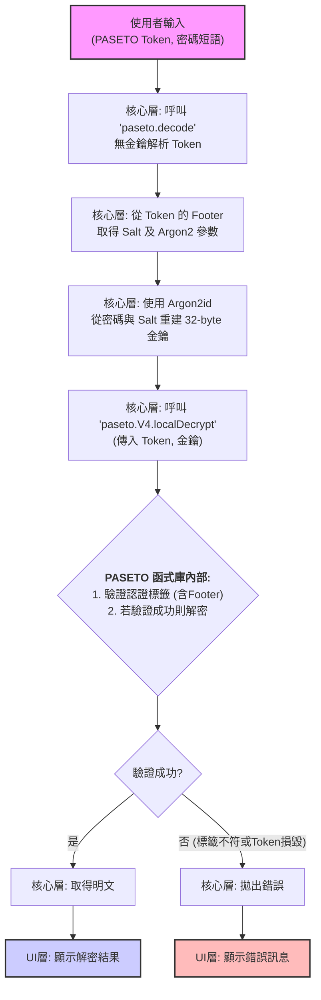

## Encipher 3.0 (PASETO 遷移) 程式開發計畫

### 1\. 總體目標與原則

本次改版的目標是開發一個全新的、符合業界標準、安全且易於維護的加密核心版本 (`v3.0`)。我們將遵循以下核心原則：

  * **標準化優先**：以 **PASETO v4** 協定取代原有的客製化 JSON 格式，徹底解決 AAD 序列化與實作模糊性的問題。
  * **模組化設計**：將應用程式解構成\*\*「UI 表現層」**與**「核心加密層」\*\*，兩者透過清晰的 API 介面溝通，達成高內聚、低耦合的目標。
  * **瀏覽器原生**：所有技術選型都將以現代網頁瀏覽器（支援 ES6 Modules、Web Crypto API）為第一執行環境。
  * **安全不妥協**：新版將不支援向下相容，以避免引入舊格式的複雜性與潛在風險。加密參數（如 Argon2）的強度與彈性將得到完全保留。
  * **使用者體驗簡化**：透過標準化協定，我們可以簡化使用者在演算法選擇上的困惑，提供更直觀的操作。

### 2\. 技術選型 (Technology Stack)

1.  **核心協定：PASETO (Platform-Agnostic Security Tokens) `v4.local`**

      * **理由**：PASETO v4 專為現代加密而生，其規範強制使用 ChaCha20-Poly1305 與 Argon2id，並內建了標準化的 AAD（在 PASETO 中稱為 "footer"）處理機制。`local` 模式代表對稱加密，完全符合本工具的需求。這能從根本上解決所有審查報告中提到的核心風險。
      * **影響**：使用者將不再需要選擇加密演算法 (AES/ChaCha20) 或 KDF (Argon2/PBKDF2)，因為 PASETO v4 已為我們做出了最安全的標準化選擇。這將大幅簡化 UI。

2.  **核心 JavaScript 函式庫**

      * **PASETO 處理**：我們將採用業界公認的 `paseto` 函式庫（由 Panva 開發）。它支援 ES Modules，可直接在瀏覽器中透過 CDN 引入，並依賴瀏覽器原生的 Web Crypto API，效能與安全性俱佳。
      * **金鑰衍生 (KDF)**：我們將繼續使用 `argon2-browser` 函式庫。PASETO 協定本身不負責從密碼衍生金鑰，它需要一個 32 位元組的金鑰作為輸入。這與我們的架構完美契合：先用 Argon2id 從使用者密碼中衍生出金鑰，再將此金鑰交給 PASETO 函式庫進行加解密。您所重視的 Argon2 參數自訂彈性將被完整保留。
      * **Base64 編碼**：繼續使用 `js-base64`，處理 PASETO token 的編解碼。

### 3\. 新版架構設計

我們將採用建議的資料夾結構，將專案檔案更有條理地組織起來：

  * `./encipher.html` (根目錄，HTML 骨架)
  * `./css/style.css` (樣式表)
  * `./js/ui-controller.js` (UI 互動邏輯)
  * `./lib/encipher-core-3.0.js` (核心加密引擎)

#### 3.1 架構與檔案關係圖

#### 3.2 核心 API 介面 (`lib/encipher-core-3.0.js` 的職責)

`lib/encipher-core-3.0.js` 將 `export` 一個物件，包含以下非同步函式，作為與 `js/ui-controller.js` 之間的標準通訊格式：

  * `encrypt({ plaintext, passphrase, argon2Params, footer })`
  * `decrypt({ token, passphrase })`
  * `parse({ token })`

### 4\. 詳細處理流程與專家意見回應

#### 4.1 加解密流程圖

##### 加密流程

##### 解密流程

#### 4.2 回應外部專家審查結果

新的 PASETO 流程正面地回應並解決了所有五位審查者提出的核心問題：

| 專家提出的核心問題 | 新的 PASETO 流程如何解決 |
| :--- | :--- |
| **1. AAD 的序列化不確定性 (Canonicalization)**\<br\>(所有審查者共同的最高疑慮) | **【根本性解決】** PASETO 協定對 `footer` (AAD) 的序列化方式有嚴格的、跨平台一致的規範。所有序列化和驗證工作都由標準函式庫在內部完成，我們不再依賴 `JSON.stringify` 的不確定行為。 |
| **2. 客製化格式的脆弱性與實作風險**\<br\>(Reviewer 0, 2, 3, 4) | **【根本性解決】** 我們不再使用任何客製化格式。第三方開發者只需使用其慣用語言的標準 PASETO v4 函式庫，即可輕鬆、可靠地與本工具生成的密文進行互動，無需自行「手動」重建任何複雜結構。 |
| **3. API 與資料結構的不一致性**\<br\>(Reviewer 0) | **【完全解決】** PASETO v4 協定標準化了所有細節：\<br\>• **命名**：統一使用 `nonce` 的概念。\<br\>• **結構**：認證標籤 (`tag`) 的位置由協定統一處理，API 變得乾淨一致。 |
| **4. 潛在的降級攻擊風險**\<br\>(Reviewer 3) | **【完全解決】** 新版計畫已明確**移除向下相容**。系統中只存在一種格式 (`v4.local`)，沒有任何回溯相容 (fallback) 的邏輯可以被攻擊者利用。任何非法的 Token 都會被直接拒絕。 |

### 5\. 開發步驟規劃

1.  **Phase 1: 核心加密模組開發**

      * **步驟 1.1**：在 `./lib/` 資料夾中建立 `encipher-core-3.0.js` 檔案，設定好 ES Module 導出結構。
      * **步驟 1.2**：實作 `encrypt` 函式。設計 `footer` 的結構，用來存放 Argon2 的參數與鹽值。
      * **步驟 1.3**：實作 `decrypt` 函式，包含從 footer 解析參數並重建金鑰的邏輯。
      * **步驟 1.4**：實作 `parse` 函式，用於「解析參數」功能。
      * **步驟 1.5**：編寫基本的單元測試案例，確保加解密流程能夠正確往返 (round-trip)。

2.  **Phase 2: UI 與核心模組整合**

      * **步驟 2.1**：重構 `encipher.html`，將所有 CSS 移至 `./css/style.css`，並將所有 UI 互動相關的 JavaScript 邏輯移至 `./js/ui-controller.js`。
      * **步驟 2.2**：在 `encipher.html` 中，修改資源引用路徑：
          * `<link rel="stylesheet" href="css/style.css">`
          * ``
      * **步驟 2.3**：在 `js/ui-controller.js` 檔案的開頭，使用 `import Core from '../lib/encipher-core-3.0.js';` 來引入核心加密模組。
      * **步驟 2.4**：簡化 UI，移除「加密演算法」和「KDF 演算法」的選項，因為 PASETO v4 已將其固定。保留 Argon2 的參數輸入框及基準測試功能。
      * **步驟 2.5**：修改 `js/ui-controller.js` 中的事件處理函式（如 `encryptBtn.onclick`），使其呼叫 `Core` 模組提供的新 API，並處理回傳的 Promise 結果來更新畫面。

3.  **Phase 3: 文件更新與交付**

      * **步驟 3.1**：更新 `encipher.md` 技術規格文件，全面改寫為 v3.0 的 PASETO 架構，包含新的 API 介面說明與處理流程。
      * **步驟 3.2**：更新網頁上的「關於本工具 / 技術規格說明」區塊，向使用者和開發者解釋新架構的優點。
      * **步驟 3.3**：進行完整的端對端測試，確保所有檔案路徑與功能皆正常運作。

### 6\. 風險評估與應對

  * **風險**：CDN 上的函式庫 (`paseto`, `argon2-browser`) 未來可能發生中斷或不相容更新。
      * **應對**：在 `encipher.html` 中使用 SRI (Subresource Integrity) hash 來確保載入的檔案未被竄改。同時，在開發時鎖定函式庫的特定版本號。
  * **風險**：使用者可能對於選項減少感到困惑。
      * **應對**：在 UI 中明確溝通，解釋「為提供最高安全性，新版採用 PASETO 標準協定，演算法已由專家預設為最佳組合」，將其作為一個安全升級的優點來呈現。