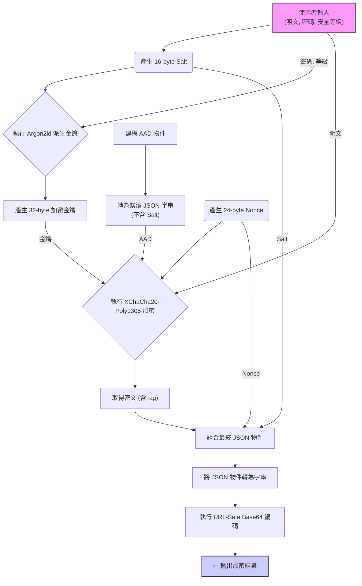
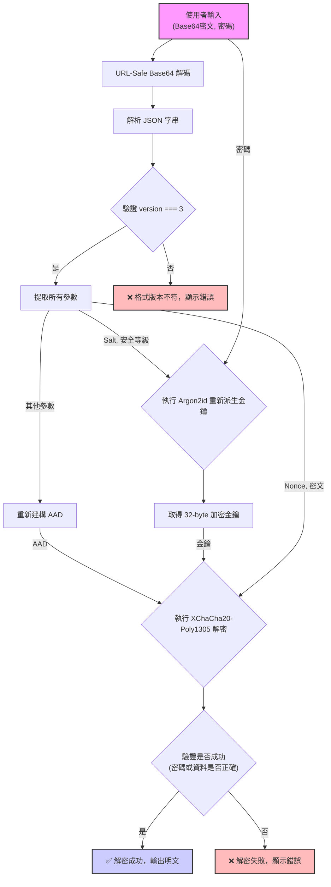

## Encipher v3: 分析設計文件 (`README.md`)

# Encipher v3: A Modern Client-Side Encryption Tool

Encipher 是一個純前端的進階加密與解密工具，致力於提供最高等級的安全性與隱私保護。所有加密運算都在您的瀏覽器本機完成，任何敏感資料絕不會離開您的電腦。本工具採用了 `libsodium.js` 作為其唯一的密碼學核心，確保了演算法的現代性、安全性與實作的穩健性。

[](https://libsodium.gitbook.io/doc/)
[](https://github.com/jedisct1/libsodium.js)
[](https://opensource.org/licenses/MIT)

## ✨ 主要特色 (Features)

* **純客戶端運作**：您的隱私是第一順位。所有操作都在瀏覽器中進行，無需網路連線。
* **頂級加密套件**：獨家採用 `libsodium` 推薦的 **Argon2id** (金鑰派生) 和 **XChaCha20-Poly1305** (對稱加密)，提供對抗現代攻擊的強大防護。
* **模式多樣性**：支援「純文字」與「檔案」(最大 10MB) 兩種加解密模式。
* **資訊透明**：加密後的資料結構包含所有必要的解密參數，並可透過工具內的解析功能檢視。
* **簡易安全等級**：將 Argon2id 的複雜參數抽象為「互動級」、「中等級」、「敏感級」三個選項，兼顧安全與效能。
* **便利的分享機制**：純文字加密結果可生成 QR Code，方便在不同裝置間傳輸。

---

## 🛠️ 技術棧 (Technology Stack)

* **核心加密庫**: `libsodium-wrappers.js` v0.7.13 (WebAssembly)
    * 提供了所有核心的加密原語，包括 Argon2id 和 XChaCha20-Poly1305。
* **前端框架**: 無 (使用原生 Vanilla JavaScript ES Module)。
* **UI/UX 輔助庫**:
    * `qrcode.js`: 用於將加密結果生成 QR Code。
    * `js-base64`: 提供穩定可靠的 URL-Safe Base64 編解碼功能。
* **執行環境**: 任何支援 Web Crypto API 和 WebAssembly 的現代網頁瀏覽器。

---

## 🔬 演算法選擇 (Algorithm Selection)

`libsodium` 函式庫提供了多種經過專家審核的現代加密演算法。本工具基於其「專家意見」的設計哲學，從中選擇了推薦的、最適合本應用場景的演算法組合。

| 加密類別 | libsodium.js 支援的演算法 | 本工具的選擇 | 選擇理由 |
| :--- | :--- | :--- | :--- |
| **金鑰派生 (KDF)** | **Argon2id**, Argon2i, PBKDF2 | ✅ **Argon2id** | 密碼雜湊競賽冠軍，對抗 GPU/ASIC 暴力破解的能力最強。 |
| **對稱加密 (AEAD)**| **XChaCha20-Poly1305**, AES-256-GCM | ✅ **XChaCha20-Poly1305** | 安全性與 AES-GCM 同級，但 Nonce 更長 (24位元組)，使其在大規模或隨機生成場景下更安全、不易碰撞。 |
| **雜湊函式** | **BLAKE2b**, SHA-256, SHA-512 | ✅ **BLAKE2b** (內部使用) | 速度比 SHA-2/3 更快，同時提供極高的安全性。 |
| **非對稱加密** | **X25519** (Curve25519) | (不適用) | 本工具專注於對稱加密，未使用非對稱加密功能。 |

---

## 📄 技術規格 (Technical Specification)

### 1. 總覽 (Overview)

所有加密操作的最終輸出都是一個 **URL-Safe Base64** 編碼的 JSON 字串。該格式封裝了從使用者密碼派生加密金鑰以及執行對稱加密所需的所有參數。

### 2. 資料結構 (Data Structure)

將最終的 Base64 字串解碼後，會得到一個 UTF-8 編碼的 JSON 物件，其結構如下：

```json
{
  "version": 3,
  "keyDerivation": {
    "name": "Argon2id13",
    "salt": "BASE64_URL_SALT",
    "opslimit": "sensitive",
    "memlimit": "sensitive"
  },
  "encryption": {
    "name": "XChaCha20-Poly1305",
    "nonce": "BASE64_URL_NONCE",
    "ciphertext": "BASE64_URL_CIPHERTEXT"
  }
}
````

#### 欄位詳解

| 欄位 | 型別 | 描述 |
| :--- | :--- | :--- |
| `version` | Integer | **格式版本號**。固定為 `3`。 |
| `keyDerivation.name`| String | 金鑰派生函數名稱，固定為 `"Argon2id13"`。 |
| `keyDerivation.salt`| String | **URL-Safe Base64** 編碼的 16 位元組隨機 Salt。 |
| `keyDerivation.opslimit`| String | Argon2id 的運算複雜度等級，來自 `["interactive", "moderate", "sensitive"]`。 |
| `keyDerivation.memlimit`| String | Argon2id 的記憶體用量等級，來自 `["interactive", "moderate", "sensitive"]`。 |
| `encryption.name` | String | 對稱加密演算法名稱，固定為 `"XChaCha20-Poly1305"`。 |
| `encryption.nonce` | String | **URL-Safe Base64** 編碼的 24 位元組隨機 Nonce。 |
| `encryption.ciphertext`| String | **URL-Safe Base64** 編碼的密文 (此密文已包含 Poly1305 的 16 位元組驗證標籤)。 |

### 3\. AAD (認證附加資料) 的建構規則

為了防止加密參數被惡意竄改，本格式採用了 **AAD (Authenticated Additional Data)**。**要成功解密，AAD 的重建必須與加密時完全一致。**

#### AAD 的精確建構規則

AAD 是一個由以下特定結構的物件，經過**緊湊 JSON 序列化**（無換行或多餘空白）後，再進行 UTF-8 編碼得到的位元組陣列。

```json
{
  "version": 3,
  "keyDerivation": {
    "name": "Argon2id13",
    "opslimit": "sensitive",
    "memlimit": "sensitive"
  },
  "encryptionName": "XChaCha20-Poly1305"
}
```

*注意：AAD 中**絕不能包含** `salt` 或 `nonce`。*

**範例 AAD 緊湊 JSON 字串:**
`{"version":3,"keyDerivation":{"name":"Argon2id13","opslimit":"sensitive","memlimit":"sensitive"},"encryptionName":"XChaCha20-Poly1305"}`

### 4\. 輸出格式範例 (Output Example)

這是一個使用本工具加密後產生的完整 JSON 物件範例（Base64 編碼前）：

```json
{
  "version": 3,
  "keyDerivation": {
    "name": "Argon2id13",
    "salt": "lAIrF3fV_p-s_5_G9p4e-A",
    "opslimit": "sensitive",
    "memlimit": "sensitive"
  },
  "encryption": {
    "name": "XChaCha20-Poly1305",
    "nonce": "kM1edp-s_z4e_8cT9L7R-n2o_6_Y5d3B",
    "ciphertext": "..."
  }
}
```

-----

## 🌊 核心功能流程圖 (Core Process Flowcharts)

### 加密流程



### 解密流程



-----

## 🚀 使用方式 (Usage)

本工具為單一 HTML 檔案，無需安裝或伺服器。

1.  下載 `encipher.html` 檔案。
2.  在任何現代網頁瀏覽器中打開即可使用。

## 📜 授權 (License)

本專案採用 [MIT License](https://opensource.org/licenses/MIT) 授權。
