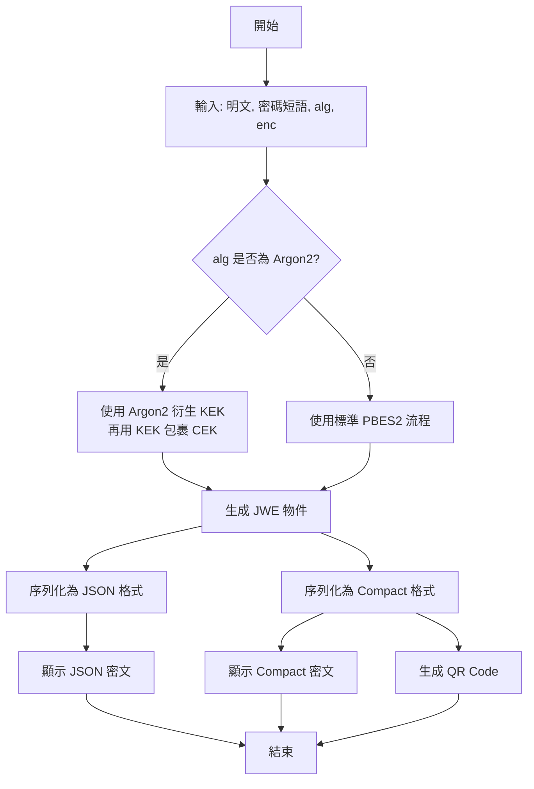
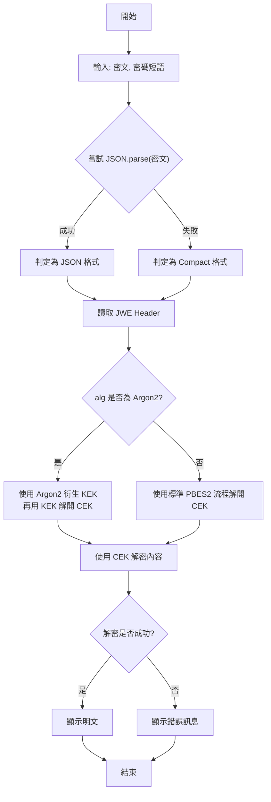

# **JWE 標準化重構最終設計文件 (v3.2)**

## **1. 專案概述 (Project Overview)**

本文件旨在定義將「進階加密、解密器」工具從自訂格式重構為符合 **JWE (JSON Web Encryption, RFC 7516)** 標準的最終設計方案。此方案基於我們 v2.0 版本的討論共識，並將作為實際開發工作的唯一依據。

### **1.1. 核心目標**

  * **符合標準 (Standard Compliance)**: 確保工具的加密產出在選用標準演算法時，100% 符合 JWE 規範。
  * **互操作性 (Interoperability)**: 使其他任何支援 JWE 的第三方工具或函式庫都能夠解密本工具的產出。
  * **代碼現代化 (Code Modernization)**: 移除所有舊版自訂格式的相容性程式碼，使代碼庫更簡潔、安全且易於維護。
  * **體驗優化 (UX Enhancement)**: 在維持既有良好操作流程的基礎上，提供更清晰的資訊與更強大的功能。

### **1.2. 核心技術棧**

  * **JWE 函式庫**: **`jose`** (A zero-dependency JWT, JWS, JWE, JWK, JWA implementation for JavaScript).
  * **非標準 KDF 函式庫**: **`argon2-browser`** (用於支援 Argon2id)。
  * **前端框架**: 無 (Vanilla JavaScript)。

-----

## **2. 使用者介面 (UI) 與體驗 (UX) 設計**

### **2.1. JWE 標準說明區塊**

  * **位置**: 應用程式主標題下方。
  * **形式**: 使用 HTML 的 `
` 與 `
` 標籤建立一個預設收合的區塊。
  * **內容**:
      * 簡要說明本工具採用 IETF 的 JWE (RFC 7516) 標準。
      * 包含給開發者的 **Argon2 解密指引** (詳見 3.3 節)。

### **2.2. 演算法選擇介面**

#### **2.2.1. 金鑰管理演算法 (alg)**

  * **標籤**: `金鑰管理演算法 (alg)`
  * **選項**:
    1.  `PBES2-HS256+A128KW` (基於 PBKDF2)
    2.  `PBES2-Argon2id+A128KW (非標準擴充)`
  * **預設行為**:
      * 預設選擇 `PBES2-HS256+A128KW`。
      * `Argon2` 參數設定區塊 (`#argon2-params-section`) 預設為**隱藏**。
      * 僅當使用者手動點選選擇 `PBES2-Argon2id+A128KW` 時，該區塊和相關警告提示才會顯示。

#### **2.2.2. 內容加密演算法 (enc)**

  * **標籤**: `內容加密演算法 (enc)`
  * **選項**:
    1.  `A256GCM` (JWE 標準識別碼 for AES-256-GCM)
    2.  `C20P` (JWE 標準識別碼 for ChaCha20-Poly1305)
  * **預設行為**: 預設選擇 `A256GCM`。

### **2.3. 加密結果顯示介面**

加密操作成功後，`#results-area` 區塊將更新並包含以下內容：

1.  **JWE JSON Serialization 顯示區**

      * **標籤**: `JWE 密文 (JSON 格式)`
      * **元件**: 一個唯讀的 `<textarea>`，顯示完整的 JSON 物件格式密文。
      * **操作**: 一個專屬的「複製 JSON」按鈕。

2.  **JWE Compact Serialization 顯示區**

      * **標籤**: `JWE 密文 (Compact 格式)`
      * **元件**: 一個唯讀的 `<textarea>`，顯示由 `.` 連接的緊湊字串格式密文。
      * **操作**: 一個專屬的「複製 Compact」按鈕。

3.  **QR Code 顯示區**

      * **元件**: `<canvas id="qrCanvas">`
      * **資料來源**: 固定使用 **JWE Compact Serialization** 的字串來生成 QR Code。

### **2.4. 解密介面**

  * **輸入**: 維持單一的 `<textarea>` 供使用者貼上密文。
  * **解析**: 「解析參數」按鈕的功能更新為解析 JWE 保護標頭，並以友善的格式顯示 `alg`, `enc` 及相關金鑰衍生參數。

-----

## **3. 功能與技術規格**

### **3.1. 加密流程**

1.  **收集輸入**: 獲取使用者輸入的明文、密碼短語，以及選擇的 `alg` 和 `enc` 演算法。
2.  **呼叫加密**:
      * 使用 `jose` 函式庫提供的 `pbes2-encrypt` 或相關方法。
      * 如果是自訂的 Argon2 `alg`，則需先手動執行金鑰衍生與金鑰包裹 (詳見 3.3 節)。
3.  **生成序列化**:
      * 加密完成後，會得到一個 JWE 物件。
      * 將此物件分別序列化為 **JSON String** 和 **Compact String**。
4.  **更新 UI**: 將兩種格式的字串填入對應的 `<textarea>` 中，並生成 QR Code。

#### **加密流程圖 (修正版)**

### **3.2. 解密流程**

1.  **獲取輸入**: 讀取使用者在解密區塊貼上的密文字串。
2.  **格式自動偵測**:
      * 使用 `try...catch` 區塊嘗試對輸入字串執行 `JSON.parse()`。
      * **若成功**: 判定為 **JWE JSON Serialization** 格式。將解析後的物件傳遞給解密函式。
      * **若失敗**: 判定為 **JWE Compact Serialization** 格式。將原始字串直接傳遞給解密函式。
3.  **呼叫解密**: 使用 `jose` 函式庫提供的 `pbes2-decrypt` 或相關方法執行解密。
4.  **顯示結果**:
      * **若成功**: 在結果區塊顯示解密後的明文。
      * **若失敗**: 顯示統一的錯誤訊息，如「解密失敗：密碼短語不正確，或密文格式無效/已損毀」。

#### **解密流程圖 (修正版)**

### **3.3. 非標準擴充：Argon2 處理方案**

為支援 `Argon2id`，同時維持最大程度的 JWE 架構相容性，將實作以下機制：

  * **自定義 `alg` 標識**: `PBES2-Argon2id+A128KW`

  * **JWE 保護標頭 (Protected Header) 擴充欄位**:

      * `p2m`: Memory Cost (記憶體，單位 KiB)
      * `p2t`: Time Cost (迭代次數)
      * `p2p`: Parallelism Cost (平行度)
      * `p2s`: Salt (Base64URL 編碼)

  * **UI 警告**: 當使用者選擇 Argon2 選項時，將在介面上顯示醒目、不可關閉的警告訊息，說明此為非標準選項及其相容性風險。

  * **開發者指引 (置於 JWE 說明區塊內)**:

    > #### **給開發者的 Argon2 解密指引**

    > 如果您需要用其他語言或函式庫解密由本工具 `PBES2-Argon2id+A128KW` 演算法加密的密文，請遵循以下步驟：

    > 1.  **解析 JWE 保護標頭**: 從 `protected` 欄位中解碼並讀取以下參數：
    >       * `alg`: "PBES2-Argon2id+A128KW"
    >       * `enc`: (例如 "A256GCM")
    >       * `p2s`: Base64URL 編碼的 Salt
    >       * `p2m`, `p2t`, `p2p`: Argon2id 的 Memory, Time, Parallelism 參數
    > 2.  **衍生金鑰加密金鑰 (KEK)**: 使用 Argon2id 函式庫，將使用者輸入的密碼短語、步驟 1 取得的 Salt 及相關參數，衍生出一個 128-bit (16-byte) 的金鑰。此即為 KEK。
    > 3.  **解開內容加密金鑰 (CEK)**: JWE 中的 `encrypted_key` 欄位是由 AES Key Wrap (RFC 3394) 演算法加密的。請使用步驟 2 的 KEK 和對應的 AES Key Unwrap 演算法 (A128KW) 解密 `encrypted_key`，即可得到原始的 CEK。
    > 4.  **解密主密文**: 使用步驟 3 得到的 CEK，以及 `enc`, `iv`, `tag` 等標準 JWE 欄位，即可使用對應的對稱加密演算法 (如 AES-256-GCM) 解密 `ciphertext`，還原明文。