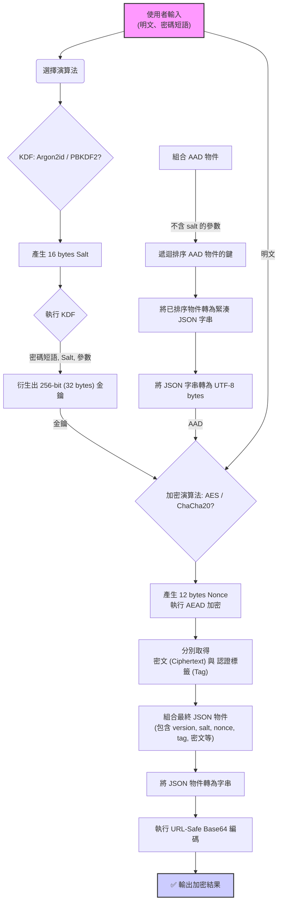
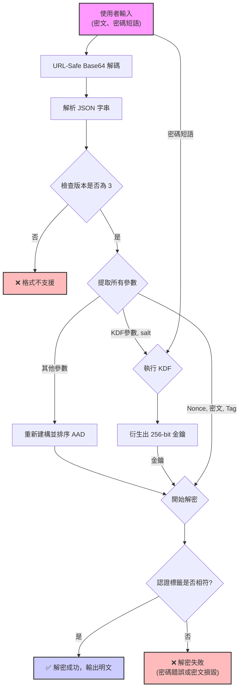

### **進階加密、解密器：v3.0 技術規格與實作指南 (修訂版)**

**Advanced Encryptor/Decryptor: v3.0 Technical Specification & Implementation Guide (Revised)**

這是一份針對「進階加密、解密器」瀏覽器工具的官方技術文件。其主要目的是詳細闡述該工具使用的客製化加密資料結構與流程，並記錄其參考實作的安全強化功能，以利於第三方開發者能夠建立相容的解密應用程式。

## 1\. 背景與介紹

「進階加密、解密器」是一個完全在使用者瀏覽器本機端運行的純前端加解密工具。它致力於提供一個安全、可靠且透明的方式來保護敏感的文字資訊與檔案，確保使用者的任何資料都不會上傳至任何伺服器。

由於本工具並未採用如 JWE (JSON Web Encryption) 等標準化加密格式，而是使用了一套客製化的 JSON 結構來封裝加密所需的所有參數。因此，這份文件至關重要，它將作為實現跨平台、跨語言解密的唯一藍圖。

### 主要特色

  * **純客戶端運作**：所有加解密運算皆在瀏覽器中完成，保障最高等級的隱私。
  * **現代化加密演算法**：支援 `AES-256-GCM` 與 `ChaCha20-Poly1305`，兩者均為具備認證加密 (AEAD) 特性的高效演算法。
  * **強化的金鑰衍生函數 (KDF)**：採用 `Argon2id` 與 `PBKDF2`，有效對抗暴力破解與彩虹表攻擊。
  * **動態參數建議**：內建基準測試功能 ⚡️，可為使用者的裝置產生兼具效能與安全性的客製化 Argon2 參數。
  * **模式多樣性**：支援「純文字」與「檔案」兩種加解密模式。
  * **資訊透明**：加密後的資料結構包含所有必要的解密參數（演算法、迭代次數等），並可透過工具內的解析功能檢視。
  * **便利的分享機制**：純文字加密結果可生成 QR Code，方便在不同裝置間傳輸。
  * **[新功能] 密碼強度即時反饋**：在使用者輸入密碼時，提供視覺化的強度評估，引導使用者採用更安全的密碼。
  * **[新功能] 主動式安全參數檢查**：應用程式會主動檢查 Argon2 參數，防止使用者設定低於安全基準的值。
  * **[新功能] 加密後自我驗證**：提供可選功能，在加密完成後立刻進行一次內部解密驗證，確保加密結果的完整性與正確性。

-----

## 2\. v3.0 技術規格

本工具的核心在於其定義的加密輸出格式。所有加密操作最終都會產生一個 Base64 編碼的 JSON 字串。

### 2.1. 最終輸出格式

加密後的最終結果是一個 **URL-Safe Base64** 字串。將其解碼後，會得到一個 UTF-8 編碼的 JSON 物件，其 v3.0 結構如下。

```json
{
  "version": 3,
  "keyDerivation": {
    "name": "Argon2id",
    "salt": "...",
    "iterations": 4,
    "memory": 65536,
    "parallelism": 4
  },
  "encryption": {
    "name": "AES-GCM",
    "nonce": "...",
    "ciphertext": "...",
    "tag": "..."
  }
}
```

### 2.2. 資料結構詳解

#### 2.2.1. 根物件 (Root Object)

| 欄位 | 型別 | 說明 |
| :--- | :--- | :--- |
| `version` | Integer | **格式版本號**。目前版本為 `3`。此欄位用於識別格式，確保解密器使用正確的規則。 |
| `keyDerivation` | Object | 包含金鑰衍生所需的所有參數。詳見 2.2.2。 |
| `encryption` | Object | 包含對稱加密所需的所有參數與密文。詳見 2.2.3。 |

#### 2.2.2. 金鑰衍生 (`keyDerivation`) 物件

此物件定義了如何從使用者的密碼短語 (Passphrase) 產生對稱加密金鑰。

| 欄位 | 型別 | KDF | 說明 |
| :--- | :--- | :--- | :--- |
| `name` | String | All | 金鑰衍生函數的名稱。可為 `"Argon2id"` 或 `"PBKDF2"`。 |
| `salt` | String | All | 用於 KDF 的鹽值，為 **URL-Safe Base64** 編碼的 16 位元組隨機值。 |
| `iterations` | Integer | All | 迭代次數。 |
| `memory` | Integer | Argon2id | **(Argon2id 專用)** 所需記憶體，單位為 **KiB** (e.g., `65536` 代表 64MB)。 |
| `parallelism` | Integer | Argon2id | **(Argon2id 專用)** 平行度。 |
| `hash` | String | PBKDF2 | **(PBKDF2 專用)** 內部使用的雜湊函數，固定為 `"SHA-256"`。 |

#### 2.2.3. 加密 (`encryption`) 物件

此物件定義了對稱加密所使用的演算法、參數及最終的加密結果。**v3.0 統一了所有演算法的結構**。

| 欄位 | 型別 | 演算法 | 說明 |
| :--- | :--- | :--- | :--- |
| `name` | String | All | 對稱加密演算法名稱。可為 `"AES-GCM"` 或 `"ChaCha20-Poly1305"`。 |
| `nonce` | String | All | **Nonce** (Number used once)，為 **URL-Safe Base64** 編碼的 12 位元組隨機值。 |
| `ciphertext` | String | All | 密文主體，**URL-Safe Base64** 編碼。**不包含**認證標籤。 |
| `tag` | String | All | **認證標籤 (Authentication Tag)**，為 **URL-Safe Base64** 編碼的 16 位元組值。 |

### 2.3. 認證附加資料 (AAD) 的處理規則 (關鍵)

為了防止對加密參數的惡意竄改，本工具在加密過程中採用了 **AAD (Authenticated Additional Data)**。AAD 是一組不會被加密，但其**完整性會受到加密演算法保護**的資料。

**要成功解密，AAD 的重建必須與加密時完全一致。** 這是實作相容解密器時最重要也最容易出錯的部分。

#### AAD 的標準化建構規則 (v3.0)

AAD 本身是一個**緊湊的 (無多餘空白)、UTF-8 編碼的 JSON 字串**。它由一個經過**標準化序列化 (Canonicalization)** 的物件產生。

**建構步驟：**

1.  建立一個新的物件來代表 AAD 的內容。
2.  將 `version` 欄位複製到新物件中。
3.  建立一個 `keyDerivation` 子物件，並只複製**非敏感**的 KDF 參數 (`name`, `iterations`, `memory`, `parallelism`, `hash`)。**絕對不能包含 `salt`**。
4.  將 `encryption.name` 欄位複製到新物件中，並命名為 `encryptionName`。
5.  **【關鍵步驟】** 對上一步驟建立的物件進行**標準化序列化**：
      * **遞迴地對物件的所有層級，將其鍵 (key) 按照字母順序進行排序。**
6.  將這個**已排序**的物件序列化為**緊湊的 JSON 字串**（例如 `JSON.stringify(sortedObj)`）。
7.  將此字串以 UTF-8 編碼轉換為位元組陣列，這就是最終要傳遞給解密函式庫的 AAD。

#### AAD 結構範例 (v3.0)

**情境：Argon2id + AES-GCM**

  * **原始參數 (部分)**
    ```json
    {
      "version": 3,
      "keyDerivation": {
        "name": "Argon2id",
        "iterations": 4,
        "memory": 65536,
        "parallelism": 4
      },
      "encryption": { "name": "AES-GCM" }
    }
    ```
  * **對應的 AAD 緊湊 JSON 字串 (鍵已排序)**
    ```json
    {"encryptionName":"AES-GCM","keyDerivation":{"iterations":4,"memory":65536,"name":"Argon2id","parallelism":4},"version":3}
    ```

### 2.4. 版本相容性

**v3.0 版本不相容於任何舊版格式 (`v1`, `v2`)。**

一個穩健的 v3.0 解密器**不應**實作任何回溯相容邏輯。解密流程應簡化為：

1.  檢查 `version` 是否為 `3`。若否，則拒絕處理。
2.  嚴格按照 `v3.0` 規則重建 AAD 並執行解密。
3.  若解密失敗，直接回報錯誤（密碼錯誤或密文損毀）。

### 2.5. Argon2 參數選擇理念與建議

(此節內容與舊版相同，依然有效)

對於希望建立相容**加密器**的開發者，理解 Argon2 參數的選擇至關重要。本工具的目標是在**互動式場景**下，平衡安全性與使用者體驗。

  * **防禦策略：優先提升記憶體 (m)**
    Argon2id 的核心優勢在於其高記憶體需求，這能有效對抗現代 GPU 的大規模平行破解。因此，我們的策略是在有限的時間預算內（例如 \< 500 毫秒），盡可能最大化記憶體消耗。
  * **給開發者的靜態參數建議**
    如果您不打算實作動態基準測試，可以參考以下由 OWASP 推薦的靜態參數作為起點：
      * **互動式應用 (如本工具)**：追求快速回應。
          * `iterations`: 2
          * `memory`: 65536 (64 MiB)
          * `parallelism`: 4
      * **非互動式應用 (如後端加密)**：可接受更長延遲以換取更高安全性。
          * `iterations`: 4 或更高
          * `memory`: 262144 (256 MiB) 或更高
          * `parallelism`: 4 或更高

### 2.6. 標準測試向量 (Test Vectors)

為了協助第三方開發者驗證其解密實作的正確性，特提供以下測試案例。開發者的程式必須能夠使用相同的輸入，產生完全一致的最終 Base64 輸出。

```
// 測試案例 1: Argon2id + AES-GCM

// -- 輸入 --
明文 (Plaintext): "這是 Zanta Gemini 的一則測試訊息。"
密碼短語 (Passphrase): "a_very_secure_password_123!@#"

// -- 固定參數 --
Salt (Base64): "rpe2h31xV/P58M51o3C5/g=="
Nonce (Base64): "g2vP0G3gC1b/tW9C"
Argon2 記憶體 (KiB): 65536
Argon2 迭代次數: 4
Argon2 平行度: 4

// -- 中間產物 (必須一致) --
標準化 AAD (緊湊 JSON 字串): 
{"encryptionName":"AES-GCM","keyDerivation":{"iterations":4,"memory":65536,"name":"Argon2id","parallelism":4},"version":3}

// -- 最終輸出 (URL-Safe Base64) --
eyJ2ZXJzaW9uIjozLCJrZXlEZXJpdmF0aW9uIjp7Im5hbWUiOiJBcmdvbjJpZCIsIml0ZXJhdGlvbnMiOjQsIm1lbW9yeSI6NjU1MzYsInBhcmFsbGVsaXNtIjo0LCJzYWx0IjoicnBlMmhzMXhWL1A1OE01MW8zQzUvZyJ9LCJlbmNyeXB0aW9uIjp7Im5hbWUiOiJBRVMtR0NNIiwibm9uY2UiOiJnMjZQMEczZ0MxYi90VzlDIiwiY2lwaGVydGV4dCI6IkwzUXdqLTM2enZLUlJpSkVpMFlOSVFrNk05ZkNwS2txWl9iLUlPT2RKNkY0U1Y4dVNleXpfN3o4QSIsInRhZyI6Im1PZkpRclZtRzlBRlEwZVVtY0VSdFEifX0=
```

-----

## 3\. v3.0 處理流程圖 (Mermaid)

### 3.1. 加密流程 (v3.0)



### 3.2. 解密流程 (v3.0)



-----

## 4\. v3.0 開發者實作指南

這是一個給希望用其他語言（如 Python, Node.js, Go...）開發相容 v3.0 解密器的開發人員的指南。

#### **步驟 1：輸入處理**

  * 接收 Base64 編碼的密文字串。
  * 使用 **URL-Safe Base64** 解碼器將其轉換為位元組陣列。
  * 將位元組陣列以 UTF-8 格式解碼為 JSON 字串。
  * 將 JSON 字串解析為一個物件/字典。

#### **步驟 2：參數提取與驗證**

  * 從 JSON 物件中讀取 `version`、`keyDerivation` 物件、`encryption` 物件。
  * **驗證 `version` 欄位是否為 `3`**。如果不是，應終止處理。
  * 從 `keyDerivation` 物件中提取 KDF 名稱 (`name`)、`salt` (Base64)、以及對應的參數（`iterations` 等）。
  * 從 `encryption` 物件中提取加密演算法名稱 (`name`)、`nonce` (Base64)、`ciphertext` (Base64) 和 `tag` (Base64)。
  * 將所有 Base64 編碼的參數解碼為位元組陣列。

#### **步驟 3：金鑰衍生**

  * 根據 `keyDerivation.name` 選擇 KDF 實作。
  * **如果 `name` 是 "PBKDF2"**:
      * 使用 PBKDF2-HMAC-SHA256 演算法。
      * 輸入：使用者密碼短語、`salt` 位元組、`iterations` 次數。
      * 輸出金鑰長度應為 32 位元組 (256 bits)。
  * **如果 `name` 是 "Argon2id"**:
      * 使用 Argon2id 演算法。
      * 輸入：使用者密碼短語、`salt` 位元組、`iterations` (`time_cost`)、`memory` (`memory_cost_kib`)、`parallelism`。
      * 輸出金鑰長度應為 32 位元組 (256 bits)。

#### **步驟 4：AAD 重建 (關鍵步驟\!)**

  * **嚴格按照 `2.3. 認證附加資料 (AAD) 的處理規則 (關鍵)` 章節的描述**，重建 AAD 所需的物件。
  * **核心要求：在序列化為 JSON 字串之前，必須遞迴地對物件的所有鍵(key)進行字母序排序。**
  * 將這個**已排序**的物件序列化為一個**緊湊的** (無多餘空白) JSON 字串，並以 UTF-8 編碼為位元組陣列。

#### **步驟 5：執行解密**

  * 根據 `encryption.name` 選擇解密實作。
  * 你需要一個支援所選 AEAD 演算法的密碼學函式庫。
  * **通用輸入**：
      * 衍生的 32 位元組金鑰。
      * 12 位元組的 `nonce`。
      * 步驟 4 產生的 AAD 位元組陣列。
      * `ciphertext` 位元組陣列。
      * 16 位元組的 `tag`。
  * **注意**：你的密碼學函式庫可能需要你將 `ciphertext` 和 `tag` 位元組陣列重新組合(concatenate)後，再傳遞給解密函式。請參閱你所用函式庫的說明文件。

#### **步驟 6：輸出結果**

  * 如果解密成功，你會得到一個明文的位元組陣列。
  * 對於純文字模式，將此位元組陣列以 UTF-8 解碼為字串。
  * 對於檔案模式，將此位元組陣列直接寫入新檔案。

-----

## 5\. 參考實作：應用程式安全強化機制

本節描述的內容是官方「進階加密、解密器」工具中所包含的、**應用程式層級**的安全強化功能。這些功能**不屬於 v3.0 資料格式規格的一部分**，第三方開發者在建立相容工具時可自行決定是否實作。然而，我們強烈建議參考這些實踐來提升應用程式的整體安全性。

### 5.1. 密碼強度即時反饋

為引導使用者設定更強的密碼，本工具在密碼輸入框下方加入了即時的視覺化強度提示。

  * **機制**：根據密碼的長度、是否包含大小寫字母、數字、特殊符號等規則，即時計算強度分數。
  * **反饋**：以顏色條（紅/黃/綠）和文字（弱/中/強）向使用者顯示密碼的強度等級。
  * **目的**：此功能旨在教育並提醒使用者，幫助他們避免使用如 `password123` 或 `12345678` 等容易被破解的弱密碼。工具提供警告，但尊重使用者的最終選擇。

### 5.2. 主動式安全參數檢查

為了防止使用者因不熟悉參數意義而意外降低安全性，本工具內建了對 `Argon2id` 參數的合理性檢查。

  * **機制**：在執行加密前，程式會驗證使用者設定的 `記憶體`、`迭代次數`、`平行度` 是否低於內建的安全基準值（例如：記憶體低於 64MB 或迭代次數低於 4 次）。
  * **反饋**：如果參數低於安全基準，加密操作將被中止，並會彈出提示訊息，要求使用者調整參數。
  * **目的**：建立一道安全防線，確保即使在使用者手動調整參數的情況下，KDF 的強度依然維持在一個可接受的安全水平之上。

### 5.3. 加密後自我驗證

為確保加密流程在執行階段（Runtime）的完整性，本工具提供了一個預設啟用的可選功能，用於在加密後立刻進行自我驗證。

  * **機制**：當使用者點擊加密後，在成功產生密文的瞬間，程式會立即在內部使用相同的密碼與參數，對剛剛產生的密文嘗試進行一次完整的解密流程。
  * **反饋**：
      * **驗證成功**：向使用者回報「加密與驗證均成功」，給予使用者最高度的信心。
      * **驗證失敗**：顯示**嚴重錯誤**訊息，明確警告使用者此份密文可能已損毀，**絕對不能使用**，並建議回報此問題。
  * **目的**：捕捉可能由瀏覽器擴充功能干擾、記憶體錯誤或其他非預期因素導致的加密結果損毀，防止使用者儲存或傳送一份無法解開的無效密文。

-----

\<footer\>
\<p\>\&copy; 2025 Zanta's Utilities\</p\>
\</footer\>