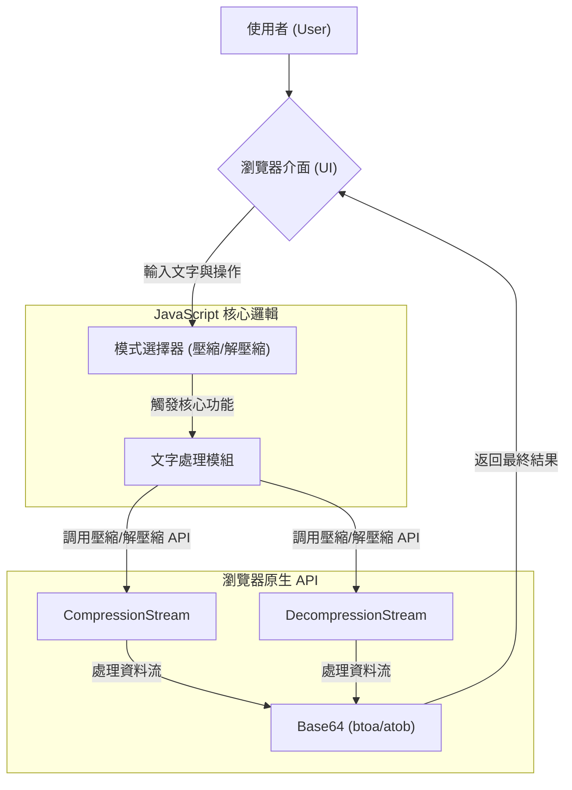

# web-text-compressor-js - 系統分析設計暨 README 文件

[](https://travis-ci.com/your-username/your-repo)
[](https://github.com/your-username/your-repo/releases)
[](https://www.google.com/search?q=./LICENSE)

-----

## 目錄 (Table of Contents)

1.  **專案概觀 (Project Overview)**
      * [1.1. 專案簡介](https://www.google.com/search?q=%2311-%E5%B0%88%E6%A1%88%E7%B0%A1%E4%BB%8B-introduction)
      * [1.2. 問題背景與目標](https://www.google.com/search?q=%2312-%E5%95%8F%E9%A1%8C%E8%83%8C%E6%99%AF%E8%88%87%E7%9B%AE%E6%A8%99-problem--goals)
      * [1.3. 快速上手](https://www.google.com/search?q=%2313-%E5%BF%AB%E9%80%9F%E4%B8%8A%E6%89%8B-quick-start-for-contributors)
      * [1.4. 核心功能](https://www.google.com/search?q=%2314-%E6%A0%B8%E5%BF%83%E5%8A%9F%E8%83%BD-core-features)
      * [1.5. 技術棧](https://www.google.com/search?q=%2315-%E6%8A%80%E8%A1%93%E6%A3%A7-technology-stack)
2.  **系統設計 (System Design)**
      * [2.1. 系統架構](https://www.google.com/search?q=%2321-%E7%B3%BB%E7%B5%B1%E6%9E%B6%E6%A7%8B-system-architecture)
      * [2.2. 資料模型](https://www.google.com/search?q=%2322-%E8%B3%87%E6%96%99%E6%A8%A1%E5%9E%8B-data-models)
      * [2.3. API 端點定義](https://www.google.com/search?q=%2323-api-%E7%AB%AF%E9%BB%9E%E5%AE%9A%E7%BE%A9-api-endpoint-definitions)
      * [2.4. 架構決策記錄 (ADRs)](https://www.google.com/search?q=%2324-%E6%9E%B6%E6%A7%8B%E6%B1%BA%E7%AD%96%E8%A8%98%E9%8C%84-architecture-decision-records-adrs)
      * [2.5. 安全性考量](https://www.google.com/search?q=%2325-%E5%AE%89%E5%85%A8%E6%80%A7%E8%80%83%E9%87%8F-security-considerations)
3.  **使用與開發 (Usage & Development)**
      * [3.1. 環境設定與安裝](https://www.google.com/search?q=%2331-%E7%92%B0%E5%A2%83%E8%A8%AD%E5%AE%9A%E8%88%87%E5%AE%89%E8%A3%9D-environment-setup--installation)
      * [3.2. 設定檔說明](https://www.google.com/search?q=%2332-%E8%A8%AD%E5%AE%9A%E6%AA%94%E8%AA%AA%E6%98%8E-configuration)
      * [3.3. 本機運行與測試](https://www.google.com/search?q=%2333-%E6%9C%AC%E6%A9%9F%E9%81%8B%E8%A1%8C%E8%88%87%E6%B8%AC%E8%A9%A6-running-locally--testing)
      * [3.4. 部署流程](https://www.google.com/search?q=%2334-%E9%83%A8%E7%BD%B2%E6%B5%81%E7%A8%8B-deployment)
      * [3.5. 維運與監控](https://www.google.com/search?q=%2335-%E7%B6%AD%E9%81%8B%E8%88%87%E7%9B%A3%E6%8E%A7-operations--monitoring)
4.  **專案管理 (Project Management)**
      * [4.1. 未來展望 (Roadmap)](https://www.google.com/search?q=%2341-%E6%9C%AA%E4%BE%86%E5%B1%95%E6%9C%9B-roadmap)
      * [4.2. 貢獻指南](https://www.google.com/search?q=%2342-%E8%B2%A2%E7%8D%BB%E6%8C%87%E5%8D%97-contribution-guidelines)
      * [4.3. 專案團隊與聯絡人](https://www.google.com/search?q=%2343-%E5%B0%88%E6%A1%88%E5%9C%98%E9%9A%8A%E8%88%87%E8%81%AF%E7%B5%A1%E4%BA%BA-team--contacts)
      * [4.4. 授權](https://www.google.com/search?q=%2344-%E6%8E%88%E6%AC%8A-license)

-----

## 1\. 專案概觀 (Project Overview)

### 1.1. 專案簡介 (Introduction)

這是一個純前端的線上工具，旨在提供一個快速、安全且無需後端伺服器的文字壓縮與解壓縮服務。我們的目標使用者是需要快速處理文字片段（如 Log、JSON）的開發者、資料分析師或任何一般使用者。

### 1.2. 問題背景與目標 (Problem & Goals)

  * **問題背景**: 在網路傳輸或儲存資料時，經常需要對長文字進行壓縮以節省頻寬或空間。傳統上這需要後端服務或本機安裝的工具，流程較為繁瑣，且可能涉及將敏感資料上傳至第三方伺服器，引發隱私疑慮。
  * **專案目標**:
      * 提供一個完全在瀏覽器端運行的壓縮/解壓縮工具，確保資料隱私與安全。
      * 利用現代瀏覽器原生的 `CompressionStream` API 實現高效能的 Gzip 壓縮。
      * 提供 Base64 編碼的輸出，方便在各種環境中複製與貼上。
      * 打造直覺、易用的使用者介面，並提供即時的效能統計。

### 1.3. 快速上手 (Quick Start for Contributors)

```bash
# 本專案為單一 HTML 檔案，無須複雜安裝。
# 直接下載 text_compressor.html 並在瀏覽器中開啟即可。

# 如需進行開發，請 Fork 本專案後 Clone 至本機：
git clone https://github.com/[your-username]/web-text-compressor-js.git
cd web-text-compressor-js

# 使用 Live Server 或類似工具啟動網頁即可開始修改。
```

### 1.4. 核心功能 (Core Features)

  * **Gzip 壓縮**: 將任意文字壓縮成 Gzip 格式，並輸出為 Base64 字串。
  * **Gzip 解壓縮**: 將 Gzip 壓縮並以 Base64 編碼的字串還原為原始文字。
  * **純客戶端運作**: 所有操作均在使用者瀏覽器中完成，無需網路連線，確保資料絕不外洩。
  * **效能統計**: 即時計算並顯示壓縮前後的大小及壓縮比率。
  * **一鍵複製**: 方便地複製處理結果至剪貼簿。
  * **主題切換**: 支援淺色與深色模式，提升使用者體驗。

### 1.5. 技術棧 (Technology Stack)

| 分類 | 技術/工具 |
| :--- | :--- |
| **前端** | HTML5, CSS3, Vanilla JavaScript (ES6+) |
| **核心 API** | `CompressionStream`, `DecompressionStream`, `TextEncoder`, `Clipboard API` |
| **後端** | N/A (純前端應用) |
| **資料庫** | N/A |
| **測試** | `[待補充]` |
| **部署** | 任何靜態網頁託管服務 (e.g., GitHub Pages, Netlify, Vercel) |

-----

## 2\. 系統設計 (System Design)

### 2.1. 系統架構 (System Architecture)

本工具為一個單頁應用程式 (SPA)，所有邏輯皆在客戶端瀏覽器中執行，架構極為單純。

#### 架構圖



#### 元件說明

  * **瀏覽器介面 (UI)**: 使用者進行文字輸入、模式選擇和操作觸發的介面。
  * **JavaScript 核心邏輯**: 負責處理 UI 事件、根據當前模式調用對應的壓縮或解壓縮函式，並更新 UI 顯示結果與統計數據。
  * **瀏覽器原生 API**: 系統的核心動力，直接利用瀏覽器內建的高效能 API 進行資料處理，無需載入任何外部函式庫。

### 2.2. 資料模型 (Data Models)

本工具為無狀態 (Stateless) 應用，不涉及複雜的資料模型或資料庫儲存。所有資料（輸入文字、輸出結果）僅在當前的操作週期中存在於記憶體。

### 2.3. API 端點定義 (API Endpoint Definitions)

本工具為純前端應用，不對外提供任何 API 端點。

### 2.4. 架構決策記錄 (Architecture Decision Records, ADRs)

本專案的重要架構決策被記錄在 `docs/adr/` 目錄下。ADR 是一種輕量級文件，用於記錄某個重要決策的「背景」、「決策內容」與「後果」。

  * `[待補充]`

### 2.5. 安全性考量 (Security Considerations)

  * **機敏資訊管理**: 本工具完全在客戶端瀏覽器運行，任何輸入的文字都不會被傳送到任何伺服器，從根本上保障了資料的隱私與安全。專案本身不包含任何 `.env` 或 API 金鑰等機敏資訊。
  * **相依套件弱點**: 本專案未使用任何第三方 JavaScript 套件，因此沒有來自相依套件的潛在弱點。
  * **常見漏洞防範**: 作為一個純前端靜態頁面，主要的安全考量在於防止跨網站指令碼 (XSS)。本專案透過將輸出結果設定在 `readonly` 的 `<textarea>` 中，並使用 `.textContent` 或 `.value` 而非 `.innerHTML` 來更新 DOM 內容，有效降低了 XSS 風險。

-----

## 3\. 使用與開發 (Usage & Development)

### 3.1. 環境設定與安裝

此專案為單一 HTML 檔案，無需安裝或複雜的環境設定。

  * **使用者**: 直接下載 `text_compressor.html` 並使用任何現代瀏覽器（如 Chrome, Firefox, Edge）開啟即可。
  * **開發者**: 若要修改程式碼，只需一個文字編輯器（如 VS Code）和一個網頁瀏覽器即可。

### 3.2. 設定檔說明

本專案無外部設定檔 (`.env`)。所有設定（如 UI 文字）均硬編碼在 HTML 與 JavaScript 中。

### 3.3. 本機運行與測試

  * **啟動開發伺服器**: 直接在檔案系統中雙擊開啟 `text_compressor.html` 即可。為獲得最佳開發體驗（例如避免某些瀏覽器的本地檔案限制），建議使用 VS Code 的 `Live Server` 擴充套件或其他本地伺服器工具來運行。
  * **運行單元測試**: `[待補充]`
  * **運行端對端測試**: `[待補充]`

### 3.4. 部署流程

將 `text_compressor.html` 檔案部署到任何支援靜態檔案託管的平台即可。例如，可以輕易地透過 GitHub Pages, Netlify 或 Vercel 發佈。

### 3.5. 維運與監控 (Operations & Monitoring)

  * **日誌 (Logging)**: 本工具為純客戶端應用，無伺服器端日誌。所有執行錯誤將會被記錄在瀏覽器的「開發者主控台 (Developer Console)」中。
  * **監控 (Metrics)**: 無需額外監控。
  * **警報 (Alerting)**: 無需設定警報。

-----

## 4\. 專案管理 (Project Management)

### 4.1. 未來展望 (Roadmap)

  * `[待補充]`

### 4.2. 貢獻指南 (Contribution Guidelines)

我們歡迎任何形式的貢獻！請在開始前閱讀我們的 `CONTRIBUTING.md` 文件。該文件必須清楚定義以下規範：

  * **分支策略 (Git Flow)**
  * **Commit 訊息規範 (Conventional Commits)**
  * **程式碼風格 (Linting & Formatting)**
  * **Pull Request (PR) 流程與 Code Review 要求**

### 4.3. 專案團隊與聯絡人 (Team & Contacts)

| 角色 | 姓名 | 聯絡方式 (Email/Slack) |
| :--- | :--- | :--- |
| **主要開發者** | Zanta | `[待補充]` |

### 4.4. 授權 (License)

本專案採用 `MIT` 授權。