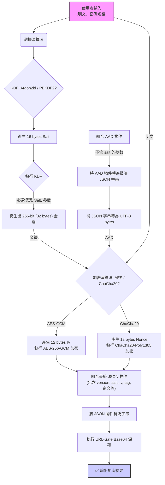
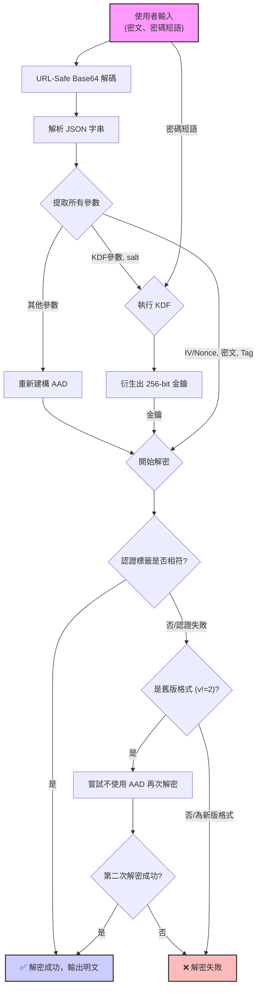

# 進階加密、解密器：技術規格與實作指南 (修正版)

**Advanced Encryptor/Decryptor: Technical Specification & Implementation Guide (Revised)**

這是一份針對「進階加密、解密器」瀏覽器工具的官方技術文件。其主要目的是詳細闡述該工具使用的客製化加密資料結構與流程，以利於第三方開發者能夠建立相容的解密應用程式。

## 1\. 背景與介紹

「進階加密、解密器」是一個完全在使用者瀏覽器本機端運行的純前端加解密工具。它致力於提供一個安全、可靠且透明的方式來保護敏感的文字資訊與檔案，確保使用者的任何資料都不會上傳至任何伺服器。

由於本工具並未採用如 JWE (JSON Web Encryption) 等標準化加密格式，而是使用了一套客製化的 JSON 結構來封裝加密所需的所有參數。因此，這份文件至關重要，它將作為實現跨平台、跨語言解密的唯一藍圖。

### 主要特色

  * **純客戶端運作**：所有加解密運算皆在瀏覽器中完成，保障最高等級的隱私。
  * **現代化加密演算法**：支援 `AES-256-GCM` 與 `ChaCha20-Poly1305`，兩者均為具備認證加密 (AEAD) 特性的高效演算法。
  * **強化的金鑰衍生函數 (KDF)**：採用 `Argon2id` 與 `PBKDF2`，有效對抗暴力破解與彩虹表攻擊。
  * **動態參數建議**：內建基準測試功能 ⚡️，可為使用者的裝置產生兼具效能與安全性的客製化 Argon2 參數。
  * **模式多樣性**：支援「純文字」與「檔案」兩種加解密模式。
  * **資訊透明**：加密後的資料結構包含所有必要的解密參數（演算法、迭代次數等），並可透過工具內的解析功能檢視。
  * **便利的分享機制**：純文字加密結果可生成 QR Code，方便在不同裝置間傳輸。

-----

## 2\. 技術規格

本工具的核心在於其定義的加密輸出格式。所有加密操作最終都會產生一個 Base64 編碼的 JSON 字串。

### 2.1. 最終輸出格式

加密後的最終結果是一個 **URL-Safe Base64** 字串。將其解碼後，會得到一個 UTF-8 編碼的 JSON 物件，其結構如下。

```json
{
  "version": 2,
  "keyDerivation": {
    "name": "Argon2id",
    "salt": "...",
    "iterations": 2,
    "memory": 65536,
    "parallelism": 4
  },
  "encryption": {
    "name": "AES-GCM",
    "iv": "...",
    "ciphertext": "...",
    "tag": "...",
    "tagLength": 128
  }
}
```

### 2.2. 資料結構詳解

#### 2.2.1. 根物件 (Root Object)

| 欄位            | 型別    | 說明                                                       |
| :-------------- | :------ | :--------------------------------------------------------- |
| `version`       | Integer | **格式版本號**。目前版本為 `2`。此欄位用於區分新舊格式，支援向下相容。 |
| `keyDerivation` | Object  | 包含金鑰衍生所需的所有參數。詳見 2.2.2。                   |
| `encryption`    | Object  | 包含對稱加密所需的所有參數與密文。詳見 2.2.3。             |

#### 2.2.2. 金鑰衍生 (`keyDerivation`) 物件

此物件定義了如何從使用者的密碼短語 (Passphrase) 產生對稱加密金鑰。

| 欄位          | 型別    | KDF      | 說明                                                               |
| :------------ | :------ | :------- | :----------------------------------------------------------------- |
| `name`        | String  | All      | 金鑰衍生函數的名稱。可為 `"Argon2id"` 或 `"PBKDF2"`。                |
| `salt`        | String  | All      | 用於 KDF 的鹽值，為 **URL-Safe Base64** 編碼的 16 位元組隨機值。     |
| `iterations`  | Integer | All      | 迭代次數。                                                         |
| `memory`      | Integer | Argon2id | **(Argon2id 專用)** 所需記憶體，單位為 **KiB** (e.g., `65536` 代表 64MB)。 |
| `parallelism` | Integer | Argon2id | **(Argon2id 專用)** 平行度。                                       |
| `hash`        | String  | PBKDF2   | **(PBKDF2 專用)** 內部使用的雜湊函數，固定為 `"SHA-256"`。          |

#### 2.2.3. 加密 (`encryption`) 物件

此物件定義了對稱加密所使用的演算法、參數及最終的加密結果。

| 欄位         | 型別    | 演算法              | 說明                                                                                       |
| :----------- | :------ | :------------------ | :----------------------------------------------------------------------------------------- |
| `name`       | String  | All                 | 對稱加密演算法名稱。可為 `"AES-GCM"` 或 `"ChaCha20-Poly1305"`。                              |
| `iv`         | String  | AES-GCM             | **(AES-GCM 專用)** 初始向量 (Initialization Vector)，為 **URL-Safe Base64** 編碼的 12 位元組隨機值。 |
| `ciphertext` | String  | All                 | 密文主體，**URL-Safe Base64** 編碼。**注意**：對於 `ChaCha20-Poly1305`，此欄位已包含認證標籤 (Tag)。 |
| `tag`        | String  | AES-GCM             | **(AES-GCM 專用)** 認證標籤 (Authentication Tag)，為 **URL-Safe Base64** 編碼的 16 位元組值。    |
| `tagLength`  | Integer | AES-GCM             | **(AES-GCM 專用)** 認證標籤的長度，單位為 bits，固定為 `128`。                               |
| `nonce`      | String  | ChaCha20-Poly1305 | **(ChaCha20-Poly1305 專用)** Nonce 值，為 **URL-Safe Base64** 編碼的 12 位元組隨機值。       |

### 2.3. 認證附加資料 (AAD) 的處理規則 (重要)

為了防止對加密參數的惡意竄改，本工具在加密過程中採用了 **AAD (Authenticated Additional Data)**。AAD 是一組不會被加密，但其**完整性會受到加密演算法保護**的資料。

**要成功解密，AAD 的重建必須與加密時完全一致。** 這是實作相容解密器時最容易出錯的部分。

#### AAD 的精確建構規則

AAD 本身是一個**緊湊的 (無多餘空白)、UTF-8 編碼的 JSON 字串**。這個 JSON 字串是從最終加密結構中提取的一個**子集**。

**建構步驟：**

1.  建立一個新的、空的物件來代表 AAD 的內容。
2.  將 `version` 欄位複製到新物件中。
3.  建立一個 `keyDerivation` 子物件，並只複製**非敏感**的 KDF 參數 (`name`, `iterations`, `memory`, `parallelism`, `hash`)。**絕對不能包含 `salt`**。
4.  將 `encryption.name` 欄位複製到新物件中，並命名為 `encryptionName`。
5.  **清除所有值為 `undefined` 或 `null` 的鍵**，以確保與原始碼 `_buildAad` 函數的行為完全一致。
6.  將這個建構好的物件序列化為**緊湊的 JSON 字串**（例如 `JSON.stringify(obj)`）。
7.  將此字串以 UTF-8 編碼轉換為位元組陣列，這就是最終要傳遞給解密函式庫的 AAD。

#### AAD 結構範例

**情境 1：Argon2id + AES-GCM (反映基準測試結果的範例)**

  * **最終 JSON 結構 (部分)**
    ```json
    {
      "version": 2,
      "keyDerivation": {
        "name": "Argon2id",
        "salt": "some_salt_here",
        "iterations": 2,
        "memory": 65536,
        "parallelism": 4
      },
      "encryption": {
        "name": "AES-GCM",
        "iv": "...", "ciphertext": "...", "tag": "..."
      }
    }
    ```
  * **對應的 AAD 緊湊 JSON 字串**
    ```json
    {"version":2,"keyDerivation":{"name":"Argon2id","iterations":2,"memory":65536,"parallelism":4},"encryptionName":"AES-GCM"}
    ```

**情境 2：PBKDF2 + ChaCha20-Poly1305**

  * **最終 JSON 結構 (部分)**
    ```json
    {
      "version": 2,
      "keyDerivation": {
        "name": "PBKDF2",
        "salt": "another_salt_here",
        "iterations": 2000000,
        "hash": "SHA-256"
      },
      "encryption": {
        "name": "ChaCha20-Poly1305",
        "nonce": "...", "ciphertext": "..."
      }
    }
    ```
  * **對應的 AAD 緊湊 JSON 字串**
    ```json
    {"version":2,"keyDerivation":{"name":"PBKDF2","iterations":2000000,"hash":"SHA-256"},"encryptionName":"ChaCha20-Poly1305"}
    ```

### 2.4. 回溯相容性 (Legacy Fallback)

本工具的 `version: 2` 格式引入了 AAD。舊版格式（`version` 欄位不存在或非整數）在加密時未使用 AAD。

一個穩健的解密器應該實作以下邏輯：

1.  優先嘗試使用 AAD 進行解密。
2.  如果解密失敗且錯誤為認證失敗 (Invalid Tag)，則檢查 `version` 欄位。
3.  若 `version` 欄位不為 `2`，則**再次嘗試**不帶 AAD 的解密流程 (即 AAD 參數設為 `null` 或空位元組)。

### 2.5. Argon2 參數選擇理念與建議

對於希望建立相容**加密器**的開發者，理解 Argon2 參數的選擇至關重要。本工具的目標是在**互動式場景**下，平衡安全性與使用者體驗。

  * **防禦策略：優先提升記憶體 (m)**
    Argon2id 的核心優勢在於其高記憶體需求，這能有效對抗現代 GPU 的大規模平行破解。因此，我們的策略是在有限的時間預算內（例如 \< 500 毫秒），盡可能最大化記憶體消耗。

  * **迭代次數 (t) 的選擇**
    為了將更多時間預算留給記憶體，本工具的基準測試功能會將迭代次數固定在一個較低但公認安全的基數，例如 `2`。這確保了核心防禦機制（記憶體）的強度。

  * **給開發者的靜態參數建議**
    如果您不打算實作動態基準測試，可以參考以下由 OWASP 推薦的靜態參數作為起點：

      * **互動式應用 (如本工具)**：追求快速回應。
          * `iterations`: 2
          * `memory`: 65536 (64 MiB)
          * `parallelism`: 4
      * **非互動式應用 (如後端加密)**：可接受更長延遲以換取更高安全性。
          * `iterations`: 3 或更高
          * `memory`: 262144 (256 MiB) 或更高
          * `parallelism`: 4 或更高

-----

## 3\. 處理流程圖 (Mermaid)

### 3.1. 加密流程



### 3.2. 解密流程



-----

## 4\. 開發者實作指南

這是一個給希望用其他語言（如 Python, Node.js, Go...）開發相容解密器的開發人員的指南。

#### **步驟 1：輸入處理**

  * 接收 Base64 編碼的密文字串。
  * 使用 **URL-Safe Base64** 解碼器將其轉換為位元組陣列。
  * 將位元組陣列以 UTF-8 格式解碼為 JSON 字串。
  * 將 JSON 字串解析為一個物件/字典。

#### **步驟 2：參數提取**

  * 從 JSON 物件中讀取 `version`、`keyDerivation` 物件、`encryption` 物件。
  * 從 `keyDerivation` 物件中提取 KDF 名稱 (`name`)、`salt` (Base64)、以及對應的參數（`iterations` 等）。
  * 從 `encryption` 物件中提取加密演算法名稱 (`name`)、`ciphertext` (Base64)、以及對應的參數（`iv`/`nonce`, `tag` 等）。
  * 將所有 Base64 編碼的參數（`salt`, `iv`, `nonce`, `tag`, `ciphertext`）解碼為位元組陣列。

#### **步驟 3：金鑰衍生**

  * 根據 `keyDerivation.name` 選擇 KDF 實作。
  * **如果 `name` 是 "PBKDF2"**:
      * 使用 PBKDF2-HMAC-SHA256 演算法。
      * 輸入：使用者密碼短語、`salt` 位元組、`iterations` 次數。
      * 輸出金鑰長度應為 32 位元組 (256 bits)。
  * **如果 `name` 是 "Argon2id"**:
      * 使用 Argon2id 演算法。
      * 輸入：使用者密碼短語、`salt` 位元組、`iterations` (`time_cost`)、`memory` (`memory_cost_kib`)、`parallelism`。
      * 輸出金鑰長度應為 32 位元組 (256 bits)。

#### **步驟 4：AAD 重建 (關鍵步驟\!)**

  * 嚴格按照 `2.3. 認證附加資料 (AAD) 的處理規則` 章節的描述，重建 AAD 所需的物件。
  * 將此物件序列化為一個**緊湊的** (無多餘空白) JSON 字串，並以 UTF-8 編碼為位元組陣列。

#### **步驟 5：執行解密**

  * 根據 `encryption.name` 選擇解密實作。
  * **如果 `name` 是 "AES-GCM"**:
      * 你需要一個支援 AES-GCM 的密碼學函式庫。
      * 輸入：衍生的 32 位元組金鑰、12 位元組的 `iv`、AAD 位元組陣列、`ciphertext` 位元組陣列、16 位元組的 `tag`。
      * 函式庫會同時解密並驗證認證標籤。
  * **如果 `name` 是 "ChaCha20-Poly1305"**:
      * 你需要一個支援 ChaCha20-Poly1305 的密碼學函式庫。
      * 輸入：衍生的 32 位元組金鑰、12 位元組的 `nonce`、AAD 位元組陣列、`ciphertext` 位元組陣列（**注意**：此密文已包含了 16 位元組的認證標籤在尾部）。
      * 函式庫會自動處理密文與標籤的分離、解密與驗證。

#### **步驟 6：處理回溯相容性**

  * 實作一個 `try-catch` 或等效的錯誤處理機制。
  * 如果步驟 5 的解密因「認證失敗」而拋出異常，檢查 `version` 欄位。
  * 如果 `version` 不是 `2`，則將 AAD 設為空值或 `null`，然後**重新執行一次步驟 5**。
  * 如果第二次嘗試仍然失敗，或 `version` 本身就是 `2`，則可以確定是密碼錯誤或密文損毀。

#### **步驟 7：輸出結果**

  * 如果解密成功，你會得到一個明文的位元組陣列。
  * 對於純文字模式，將此位元組陣列以 UTF-8 解碼為字串。
  * 對於檔案模式，將此位元組陣列直接寫入新檔案。

-----

\<footer\>
\<p\>\&copy; 2025 Zanta's Utilities\</p\>
\</footer\>