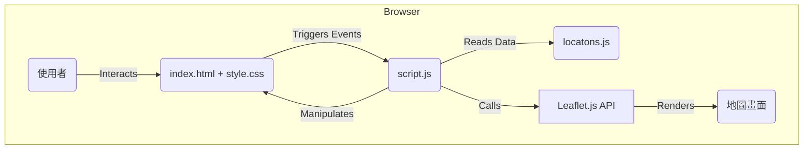

# 旅遊行程小幫手 (Travel Itinerary Helper) - 系統分析設計暨 README 文件

[](./)
[](./)
[](./LICENSE)

---

## 目錄 (Table of Contents)

1.  **專案概觀 (Project Overview)**
    * [1.1. 專案簡介](#11-專案簡介-introduction)
    * [1.2. 問題背景與目標](#12-問題背景與目標-problem--goals)
    * [1.3. 快速上手](#13-快速上手-quick-start-for-contributors)
    * [1.4. 核心功能](#14-核心功能-core-features)
    * [1.5. 技術棧](#15-技術棧-technology-stack)
2.  **系統設計 (System Design)**
    * [2.1. 系統架構](#21-系統架構-system-architecture)
    * [2.2. 資料模型](#22-資料模型-data-models)
    * [2.3. API 端點定義](#23-api-端點定義-api-endpoint-definitions)
    * [2.4. 架構決策記錄 (ADRs)](#24-架構決策記錄-architecture-decision-records-adrs)
    * [2.5. 安全性考量](#25-安全性考量-security-considerations)
3.  **使用與開發 (Usage & Development)**
    * [3.1. 環境設定與安裝](#31-環境設定與安裝-environment-setup--installation)
    * [3.2. 設定檔說明](#32-設定檔說明-configuration)
    * [3.3. 本機運行與測試](#33-本機運行與測試-running-locally--testing)
    * [3.4. 部署流程](#34-部署流程-deployment)
    * [3.5. 維運與監控](#35-維運與監控-operations--monitoring)
4.  **專案管理 (Project Management)**
    * [4.1. 未來展望 (Roadmap)](#41-未來展望-roadmap)
    * [4.2. 貢獻指南](#42-貢獻指南-contribution-guidelines)
    * [4.3. 專案團隊與聯絡人](#43-專案團隊與聯絡人-team--contacts)
    * [4.4. 授權](#44-授權-license)

---

## 1. 專案概觀 (Project Overview)

### 1.1. 專案簡介 (Introduction)

這是一個純前端的互動式地圖應用程式，旨在視覺化地展示、規劃與管理旅遊行程。我們的目標使用者是正在規劃旅行的個人，希望能透過地理視角直觀地了解行程動線。

### 1.2. 問題背景與目標 (Problem & Goals)

* **問題背景**: 傳統的條列式行程表（如 Excel 或純文字）缺乏地理空間感，使用者難以直觀判斷景點間的距離、相對位置與路線的合理性。
* **專案目標**:
    * 將行程資料與互動式地圖結合，提供一個直觀的視覺化介面。
    * 讓使用者能輕鬆篩選、搜尋特定日期或類別的行程點。
    * 提供實用的行程統計數據，如總天數、地點數與每日移動距離。
    * 支援將行程資料匯出，方便備份與列印。
    * 實現 PWA (Progressive Web App)，提供類原生的使用體驗。

### 1.3. 快速上手 (Quick Start for Contributors)

本專案為純靜態網頁應用，不需複雜的建置流程。

```bash
# 1. 複製專案
git clone [https://github.com/your-username/travel-itinerary-helper.git](https://github.com/your-username/travel-itinerary-helper.git)
cd travel-itinerary-helper

# 2. (可選) 啟動本地伺服器
# 雖然直接開啟 index.html 即可運作，但建議使用 Live Server 以獲得最佳體驗
# 例如使用 VS Code 的 "Live Server" 擴充功能，或執行 Python 指令：
python -m http.server

# 3. 在瀏覽器中開啟
# http://localhost:8000 (或您伺服器的對應網址)
````

### 1.4. 核心功能 (Core Features)

  * **行程視覺化**: 在 Leaflet 地圖上繪製所有行程點的標記(Marker)及每日路徑(Polyline)。
  * **互動式列表**: 左側面板顯示詳細的行程列表，點擊項目可將地圖聚焦到對應地點。
  * **動態篩選**: 可根據「日期」和「地點類別」（景點、住宿、交通、餐飲等）即時篩選地圖與列表內容。
  * **行程統計**: 自動計算並顯示總天數、地點總數、每日預估移動總距離。
  * **資料匯出**:
      * 可將當前行程資料匯出成 `locations.json` 檔案。
      * 可產生一個適合列印的 A4 格式行程總表。
  * **響應式設計**: 自動適應桌面及行動裝置的螢幕尺寸。
  * **PWA支援**: 包含 `manifest.json` 與 Service Worker，可被新增至主畫面並支援離線存取。

### 1.5. 技術棧 (Technology Stack)

| 分類 | 技術/工具 |
| :--- | :--- |
| **前端** | HTML5, CSS3, Vanilla JavaScript (ES6) |
| **核心函式庫** | Leaflet.js |
| **後端** | N/A (純客戶端應用) |
| **資料庫** | N/A (資料目前由 `locatons.js` 靜態提供) |
| **測試** | N/A (尚無自動化測試) |
| **部署** | 任何靜態網頁託管服務 (e.g., GitHub Pages, Netlify) |

-----

## 2\. 系統設計 (System Design)

### 2.1. 系統架構 (System Architecture)

本系統為一個單體式前端應用 (Client-Side Monolith)。所有邏輯，包括資料處理、狀態管理、UI 渲染和事件處理，都在使用者的瀏覽器中完成。

#### 架構圖



#### 元件說明

  * **`index.html`**: 應用的主要結構，定義了地圖容器、側邊欄、篩選器等 DOM 元素。
  * **`style.css`**: 負責所有 UI 元件的樣式與響應式佈局。
  * **`script.js`**: 核心商業邏輯，包含狀態管理、地圖繪製、篩選功能、事件監聽等。
  * **`locatons.js`**: 作為靜態資料庫，提供行程陣列資料。
  * **`Leaflet.js`**: 第三方函式庫，負責地圖圖磚(Tiles)的載入與所有地圖相關的互動操作。

### 2.2. 資料模型 (Data Models)

資料核心是 `locationsData` 陣列，其中每個物件代表一個行程點。

**`Location` 模型:**

```javascript
{
    "date": "2025-10-20", // 日期 (YYYY-MM-DD)
    "location": "關西國際機場 (Kansai Intl. Airport)", // 地點名稱
    "category": "transport", // 分類 (transport, food, sight, stay)
    "coordinates": [34.4343, 135.2444], // 座標 [緯度, 經度]
    "description": "抵達關西，搭乘南海電鐵前往難波。", // 描述
    "image": "" // 圖片 URL (可選)
}
```

### 2.3. API 端點定義 (API Endpoint Definitions)

本專案為純客戶端應用，不依賴任何後端 API。

### 2.4. 架構決策記錄 (Architecture Decision Records, ADRs)

[待補充] 本專案的重要架構決策被記錄在 `docs/adr/` 目錄下。ADR 是一種輕量級文件，用於記錄某個重要決策的「背景」、「決策內容」與「後果」。

### 2.5. 安全性考量 (Security Considerations)

  * **機敏資訊管理**: 目前無機敏資訊。若未來需串接 API，金鑰(API Keys)應存放於環境變數中，不可直接寫在程式碼裡。
  * **相依套件弱點**: 專案透過 CDN 載入 Leaflet.js。為增加安全性，未來可考慮使用 SRI (Subresource Integrity) hash 來確保載入的檔案未被竄改。
  * **常見漏洞防範**: 目前無使用者輸入儲存功能，XSS 風險較低。若未來增加讓使用者自訂行程的功能，所有使用者輸入的內容在渲染至畫面時，都必須進行嚴格的淨化(Sanitization)處理。

-----

## 3\. 使用與開發 (Usage & Development)

### 3.1. 環境設定與安裝

1.  **必要工具**: 一個現代的網頁瀏覽器 (如 Chrome, Firefox) 和一個程式碼編輯器 (如 VS Code)。
2.  **複製專案**: `git clone https://github.com/your-username/travel-itinerary-helper.git`
3.  **安裝相依套件**: 無。本專案未使用 npm/pnpm 等套件管理器。

### 3.2. 設定檔說明

本專案的核心設定檔為 `locatons.js`。若要修改或替換旅遊行程，請直接編輯此檔案中的 `locationsData` 陣列。

### 3.3. 本機運行與測試

  * **啟動開發伺服器**: 建議使用 VS Code 的 `Live Server` 擴充功能，或在專案根目錄執行 `python -m http.server`，然後在瀏覽器開啟對應的本地網址。
  * **運行測試**: 目前尚無自動化測試腳本。所有功能驗證均需手動進行。

### 3.4. 部署流程

本專案為純靜態檔案，可部署至任何支援靜態網站託管的平台。

1.  將專案所有檔案 (`index.html`, `style.css`, `script.js`, `locatons.js`, `manifest.json`, `sw.js` 等) 上傳至託管服務的根目錄。
2.  無需任何建置(build)步驟。

### 3.5. 維運與監控 (Operations & Monitoring)

  * **日誌 (Logging)**: 主要的日誌輸出是 Service Worker 的註冊狀態，會顯示在瀏覽器的開發者工具 Console 中。
  * **監控 (Metrics)**: 無。
  * **警報 (Alerting)**: 無。

-----

## 4\. 專案管理 (Project Management)

### 4.1. 未來展望 (Roadmap)

  * **v1.1**: 實作讓使用者直接在介面上傳自己的 `locations.json` 檔案。
  * **v1.2**: 整合瀏覽器的 Local Storage，讓使用者可以在本機儲存、編輯和管理多個行程。
  * **v1.3**: 串接地理編碼(Geocoding)服務，讓使用者可透過輸入地址或景點名稱自動產生座標。
  * **v2.0**: 發展後端服務與資料庫，實現使用者帳號系統與雲端行程同步功能。

### 4.2. 貢獻指南 (Contribution Guidelines)

我們歡迎任何形式的貢獻！請在開始前閱讀我們的 `CONTRIBUTING.md` 文件。 該文件清楚定義了以下規範：

  * **分支策略 (Git Flow)**
  * **Commit 訊息規範 (Conventional Commits)**
  * **程式碼風格 (Linting & Formatting)**
  * **Pull Request (PR) 流程與 Code Review 要求**

### 4.3. 專案團隊與聯絡人 (Team & Contacts)

| 角色 | 姓名 | 聯絡方式 (Email/Slack) |
| :--- | :--- | :--- |
| **[角色]** | [姓名] | `[待補充]` |

### 4.4. 授權 (License)

本專案採用 MIT 授權。
