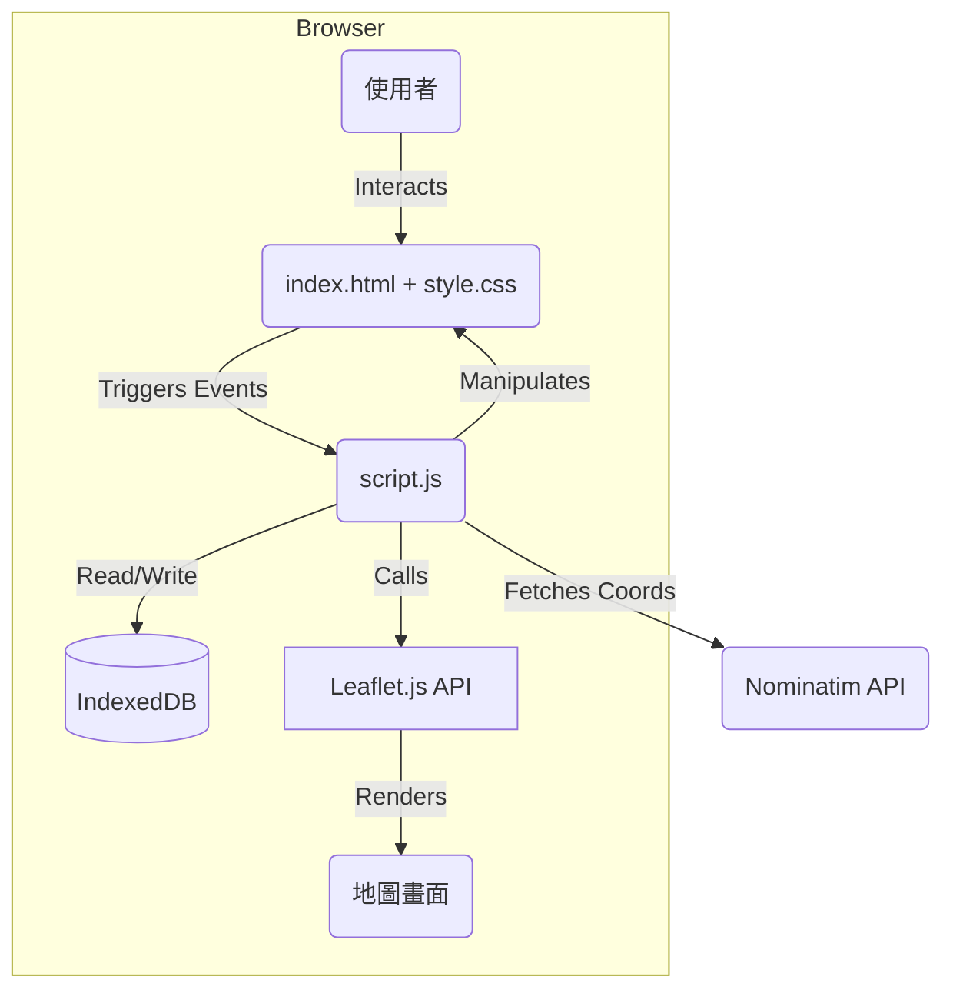

# 旅遊行程小幫手 (Travel Itinerary Helper) - 系統分析設計暨 README 文件

[](./)
[](./)
[](./LICENSE)

---

## 目錄 (Table of Contents)
---

## 1. 專案概觀 (Project Overview)

### 1.1. 專案簡介 (Introduction)

這是一個純前端的互動式地圖應用程式，旨在視覺化地展示、規劃與管理旅遊行程。 本應用讓使用者能夠在本機建立、編輯、儲存並管理自己的旅遊計畫，並透過地理視角直觀地了解行程動線。

### 1.2. 問題背景與目標 (Problem & Goals)

* **問題背景**: 傳統的條列式行程表（如 Excel 或純文字）缺乏地理空間感，使用者難以直觀判斷景點間的距離、相對位置與路線的合理性。 此外，靜態的行程資料不易修改與管理。
* **專案目標 (v2.1)**:
    * 將行程資料與互動式地圖結合，提供一個直觀的視覺化介面。
    * **實現資料持久化**：使用瀏覽器 `IndexedDB`，讓使用者可以建立、儲存、載入並管理多個行程，關閉分頁後資料不遺失。
    * **完整的編輯功能**：提供 UI 介面讓使用者能對行程中的景點進行新增、編輯、刪除與拖曳排序。
    * **密碼保護**：使用者可為自己的行程設定密碼，確保編輯權限。
    * **智慧化景點建立**：整合地理編碼 API，讓使用者透過輸入景點名稱即可自動獲取座標。
    * 提供實用的行程統計數據，如總天數、地點數與每日移動距離。
    * 支援將行程資料匯出成 `.json` 檔案（用於備份與分享）及適合列印的 A4 表格。
    * **強化安全性**: 內建基本的 XSS 防護機制。
    * **優化 API 使用**: 導入防抖 (Debounce) 機制，避免對外部服務的過度請求。

### 1.3. 快速上手 (Quick Start for Contributors)

本專案為純靜態網頁應用，不需複雜的建置流程。

```bash
# 1. 複製專案
git clone [https://github.com/your-username/travel-itinerary-helper.git](https://github.com/your-username/travel-itinerary-helper.git)
cd travel-itinerary-helper

# 2. (可選) 啟動本地伺服器
# 雖然直接開啟 index.html 即可運作，但建議使用 Live Server 以獲得最佳體驗
# 例如使用 VS Code 的 "Live Server" 擴充功能，或執行 Python 指令：
python -m http.server

# 3. 在瀏覽器中開啟
# http://localhost:8000 (或您伺服器的對應網址)
````

### 1.4. 核心功能 (Core Features)

  * **行程管理 (CRUD)**：
      * **建立/刪除行程**：在管理介面中建立新行程或刪除既有行程。
      * **載入行程**：從本機資料庫載入不同行程。
      * **匯入/匯出**：可匯入 `.json` 行程檔，也可將當前行程匯出為 `.json` 檔備份。
  * **景點管理 (CRUD)**：
      * **新增/編輯/刪除景點**：透過表單 UI 進行操作。
      * **拖曳排序**：在行程列表中，可透過拖曳調整景點順序或歸屬日期。
  * **密碼保護**：可為行程設定編輯密碼，無密碼時僅能以「唯讀模式」瀏覽。
  * **行程視覺化**: 在 Leaflet 地圖上繪製所有行程點的標記(Marker)及每日路徑(Polyline)。
  * **智慧搜尋**：新增景點時，可輸入關鍵字搜尋地點，並從結果中選擇以自動填入座標。此功能已加入**防抖**處理。
  * **動態篩選**: 可根據「日期」和「地點類別」（景點、住宿、交通、餐飲等）即時篩選地圖與列表內容。
  * **行程統計**: 自動計算並顯示總天數、地點總數、每日預估移動總距離。
  * **響應式設計**: 自動適應桌面及行動裝置的螢幕尺寸。

### 1.5. 技術棧 (Technology Stack)

| 分類 | 技術/工具 |
| :--- | :--- |
| **前端** | HTML5, CSS3, Vanilla JavaScript (ES6) |
| **核心函式庫/API** | Leaflet.js, Web Crypto API (`SubtleCrypto`) |
| **外部服務**| Nominatim (OpenStreetMap) Geocoding API |
| **資料庫** | IndexedDB (瀏覽器內建) |
| **測試** | N/A (尚無自動化測試) |
| **部署** | 任何靜態網頁託管服務 (e.g., GitHub Pages, Netlify) |

-----

## 2\. 系統設計 (System Design)

### 2.1. 系統架構 (System Architecture)

本系統為一個功能強化的單體式前端應用 (Client-Side Monolith)。所有邏輯，包括資料處理、狀態管理、UI 渲染和事件處理，都在使用者的瀏覽器中完成。 資料透過 IndexedDB 進行持久化儲存，並透過呼叫外部 API 實現地理資訊查詢。

#### 架構圖



#### 元件說明

  * **`index.html`**: 應用的主要結構，定義了所有 UI 元素，包含多個互動式彈出視窗 (Modals)。
  * **`style.css`**: 負責所有 UI 元件的樣式與響應式佈局。
  * **`script.js`**: 核心商業邏輯，包含：
      * **狀態管理**: `state` 物件，追蹤當前行程、篩選條件、編輯狀態等。
      * **資料庫模組**: 封裝了對 `IndexedDB` 的所有非同步操作 (CRUD)。
      * **加密模組**: 封裝了使用 `SubtleCrypto` API 進行密碼雜湊與驗證的邏輯。
      * **UI 渲染模組**: 根據 `state` 動態生成列表、地圖標記等。
      * **事件監聽器**: 處理所有使用者互動。
      * **工具函式**: 包含 HTML 淨化 (Sanitization) 與防抖 (Debounce) 等共用函式。
  * **`Leaflet.js`**: 第三方函式庫，負責地圖圖磚的載入與所有地圖相關的互動操作。

### 2.2. 資料模型 (Data Models)

系統包含兩種核心資料模型：`Itinerary` 和 `Location`。

**`Itinerary` 模型 (儲存於 IndexedDB):**

```javascript
{
    "id": "it_1690506000000",      // 行程的唯一識別碼 (Primary Key)
    "name": "我的沖繩夏日之旅",   // 使用者自訂的行程名稱
    "createdAt": "2025-07-28T10:00:00Z", // 建立時間戳
    "passwordHash": "a1b2c3...",  // 使用 SubtleCrypto 產生的密碼雜湊 (若無密碼則為 null)
    "passwordSalt": "d4e5f6...",  // 用於產生雜湊的鹽值 (若無密碼則為 null)
    "locations": [ /* Location 物件的陣列 */ ] 
}
```

**`Location` 模型 (儲存於 `Itinerary` 的 `locations` 陣列中):**

```javascript
{
    "id": "loc_...",      // 景點的唯一識別碼
    "date": "2025-08-15", // 日期 (YYYY-MM-DD)
    "location": "美麗海水族館", // 地點名稱
    "category": "sight",  // 分類 (transport, food, sight, stay, default)
    "coordinates": [26.693, 127.878], // 座標 [緯度, 經度]
    "description": "觀賞巨大的鯨鯊", // 描述
    "image": ""           // 圖片 URL (可選)
}
```

### 2.3. API 端點定義 (API Endpoint Definitions)

本專案呼叫一個外部 API 端點來進行地理編碼。

  * **服務**: Nominatim (OpenStreetMap)
  * **端點**: `https://nominatim.openstreetmap.org/search`
  * **方法**: `GET`
  * **用途**: 將使用者輸入的文字地點轉換為經緯度座標。
  * **範例請求**: `GET https://nominatim.openstreetmap.org/search?format=json&q=東京鐵塔&limit=5`

### 2.4. 架構決策記錄 (Architecture Decision Records, ADRs)

[待補充] 本專案的重要架構決策被記錄在 `docs/adr/` 目錄下。ADR 是一種輕量級文件，用於記錄某個重要決策的「背景」、「決策內容」與「後果」。

### 2.5. 安全性考量 (Security Considerations)

  * **跨站腳本攻擊 (XSS)**:
      * **風險**: 應用程式接受並顯示使用者輸入的內容（如行程名稱、景點名稱、描述），存在潛在的 XSS 風險。
      * **防護措施**: 已實作基本的 HTML 淨化機制。所有使用者輸入在渲染至畫面（如列表、地圖彈窗、列印頁面）前，都會經過處理，將 `<`、`>` 等特殊 HTML 字元轉換為 HTML 實體編碼，藉此防止瀏覽器將惡意輸入作為程式碼執行。
  * **API 使用政策**:
      * **User-Agent**: 所有對 Nominatim API 的呼叫，都在請求標頭中設定了一個有意義的 User-Agent，以遵守其服務條款。
      * **請求頻率**: 已針對地點搜尋的按鈕點擊事件實作「防抖 (Debounce)」機制。這能確保在使用者快速連續點擊時，只會發送一次 API 請求，有效避免對外部服務造成負擔，並符合其使用政策。
  * **客戶端密碼處理**:
      * 使用 Web Crypto API (`SubtleCrypto`) 搭配 `PBKDF2` 演算法對使用者密碼進行雜湊。
      * 為每個密碼生成獨立的隨機鹽值 (Salt)，儲存於 IndexedDB 中。
      * **限制**: 此機制僅能防止他人透過 UI 未經授權地編輯，無法防禦能夠直接讀取使用者本機 IndexedDB 檔案的攻擊。

-----

## 3\. 使用與開發 (Usage & Development)

### 3.1. 環境設定與安裝

1.  **必要工具**: 一個現代的網頁瀏覽器 (如 Chrome, Firefox) 和一個程式碼編輯器 (如 VS Code)。
2.  **複製專案**: `git clone https://github.com/your-username/travel-itinerary-helper.git`
3.  **安裝相依套件**: 無。

### 3.2. 設定檔說明

本專案已不再使用靜態設定檔。 所有行程資料皆透過應用程式介面在瀏覽器的 IndexedDB 中進行管理。

### 3.3. 本機運行與測試

  * **啟動開發伺服器**: 建議使用 VS Code 的 `Live Server` 擴充功能，或在專案根目錄執行 `python -m http.server`，然後在瀏覽器開啟對應的本地網址。
  * **運行測試**: 目前尚無自動化測試腳本。所有功能驗證均需手動進行。

### 3.4. 部署流程

本專案為純靜態檔案，可部署至任何支援靜態網站託管的平台。

1.  將專案所有檔案 (`index.html`, `style.css`, `script.js` 等) 上傳至託管服務的根目錄。
2.  無需任何建置(build)步驟。

### 3.5. 維運與監控 (Operations & Monitoring)

  * **日誌 (Logging)**: 主要的日誌集中在瀏覽器開發者工具的 Console，用於開發階段的除錯。
  * **監控 (Metrics)**: 無。
  * **警報 (Alerting)**: 無。

-----

## 4\. 專案管理 (Project Management)

### 4.1. 未來展望 (Roadmap)

  * **v2.2**:
      * **豐富化景點內容**: 實作讓使用者為景點上傳圖片的功能，並將圖片以 Base64 格式存入 IndexedDB。
      * **行程分享**: 產生一個唯讀的分享連結，可將行程資料壓縮後放在 URL Hash 中分享給他人。
  * **v2.3**:
      * **路線規劃優化**: 串接路線規劃服務 (如 OSRM)，提供更精確的每日移動距離與時間估算。
  * **v3.0**: 發展後端服務與資料庫，實現使用者帳號系統與雲端行程同步功能。

### 4.2. 貢獻指南 (Contribution Guidelines)

我們歡迎任何形式的貢獻！請在開始前閱讀我們的 `CONTRIBUTING.md` 文件。

### 4.3. 專案團隊與聯絡人 (Team & Contacts)

| 角色 | 姓名 | 聯絡方式 (Email/Slack) |
| :--- | :--- | :--- |
| **[角色]** | [姓名] | `[待補充]` |

### 4.4. 授權 (License)

本專案採用 MIT 授權。
